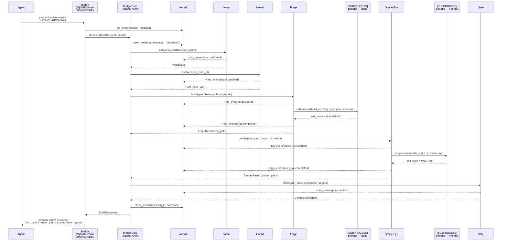
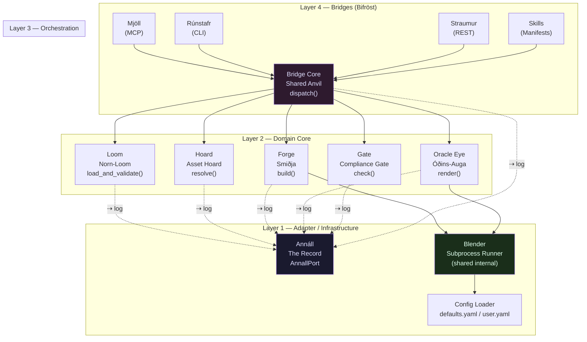
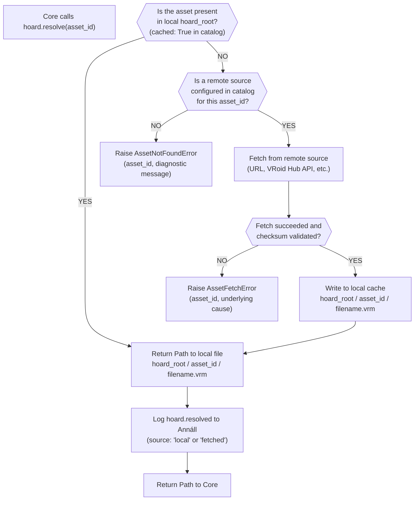
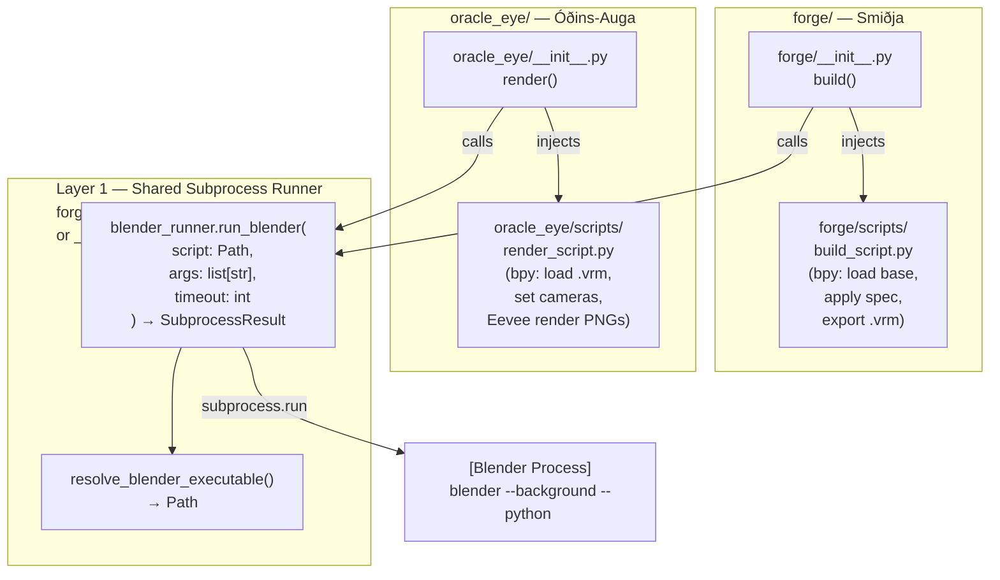
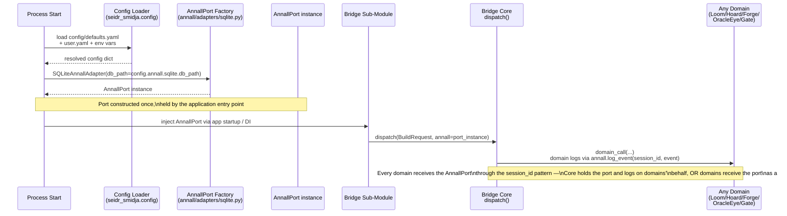
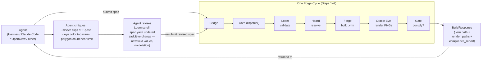

# Seiðr-Smiðja — Data Flow
**Last updated:** 2026-05-06
**Scope:** Primary Rite walkthrough, sequence diagrams, dependency graph, failure flows, concurrency model, and the three resolved tensions.
**Author:** Védis Eikleið (Cartographer)
**Legend:**
- `→` data or control flows into
- `⇢` Annáll side-write (logging event; does not block the main path)
- `?` decision point
- `[SUBPROCESS]` external process boundary (Blender)

**Cross-references:**
- [DOMAIN_MAP.md](./DOMAIN_MAP.md) — domain ownership and dependency law
- [ARCHITECTURE.md](./ARCHITECTURE.md) — layered model, subprocess pattern, concurrency
- [Loom INTERFACE](../src/seidr_smidja/loom/INTERFACE.md)
- [Hoard INTERFACE](../src/seidr_smidja/hoard/INTERFACE.md)
- [Forge INTERFACE](../src/seidr_smidja/forge/INTERFACE.md)
- [Oracle Eye INTERFACE](../src/seidr_smidja/oracle_eye/INTERFACE.md)
- [Gate INTERFACE](../src/seidr_smidja/gate/INTERFACE.md)
- [Annáll INTERFACE](../src/seidr_smidja/annall/INTERFACE.md)
- [Bridge Core INTERFACE](../src/seidr_smidja/bridges/core/INTERFACE.md)
- [Bridges INTERFACE](../src/seidr_smidja/bridges/INTERFACE.md)

---

> *The river does not choose its course at the moment of flowing. The course was cut before the first drop fell. This document shows where the water runs.*

---

## I. The Primary Rite — Full Forge Cycle

*A precise walkthrough: one build request entering through any Bridge and emerging as a `.vrm` file and render images. Every step is numbered. Each step states its owning domain, what it receives, what it produces, and what it writes to Annáll.*

---

### Step 0 — Agent Constructs the Spec
**Owner:** Agent (external to the forge)
**Receives:** Its own intent — the vision of an avatar.
**Produces:** A YAML file (or raw dict) conforming to the Loom schema, containing all avatar parameters: `spec_version`, `avatar_id`, `display_name`, `base_asset_id`, body proportions, face shape, hair, outfit, expressions, metadata, and an optional `extensions` dict.
**Writes to Annáll:** Nothing. The agent is outside the forge.

*This is the weaving before the strike — the wyrd set down before any iron moves.*

---

### Step 1 — Agent Submits Through a Bridge
**Owner:** Bridges (Mjöll / Rúnstafr / Straumur / Skills)
**Receives:** A protocol-native invocation: an MCP tool call, a `seidr build` shell command, an HTTP POST to `/build`, or a skill invocation.
**Produces:** A normalized `BuildRequest` dataclass, carrying:
- `spec_source` — the YAML path or raw dict
- `base_asset_id` — the Hoard catalog key (may be specified by agent or defaulted)
- `output_dir` — where outputs land
- `render_views` — None (full set) or an explicit subset
- `compliance_targets` — None (all) or an explicit subset
- `session_metadata` — agent identity, bridge type, timestamp
- `request_id` — a UUID minted by the Bridge sub-module
**Writes to Annáll:** Bridge sub-modules log the incoming request event via `annall.log_event()` before calling dispatch.

*The Bridge speaks the agent's dialect, then translates it into the forge's native tongue.*

---

### Step 2 — Bridge Core Opens a Session
**Owner:** Bridge Core (Shared Anvil)
**Receives:** The `BuildRequest` from the calling Bridge sub-module, plus the injected `AnnallPort` instance.
**Produces:** A `SessionID` from `annall.open_session(request.session_metadata)`. All subsequent Annáll writes in this pipeline carry this session ID.
**Writes to Annáll:** `annall.open_session()` — session record opened with agent metadata and request ID.

---

### Step 3 — Loom Validates the Spec
**Owner:** Loom
**Receives:** `request.spec_source` — either a `Path` to a YAML/JSON file or a raw `dict`.
**Produces:** A fully validated, typed `AvatarSpec` dataclass. If validation fails, raises `LoomValidationError` with a list of `ValidationFailure` objects — no partial spec is ever returned.
**Writes to Annáll:** `annall.log_event(session_id, AnnallEvent("loom.validated", {...}))` on success, or `AnnallEvent("loom.failed", {"failures": [...]})` on error.

*The Loom does not merely receive a scroll — it reads it for truthfulness. Only a complete, coherent spec passes through.*

---

### Step 4 — Hoard Resolves the Base Asset
**Owner:** Hoard
**Receives:** `request.base_asset_id` — a catalog key string such as `"vroid/tall_feminine_v1"`.
**Produces:** An absolute (runtime-resolved) `Path` to the base `.vrm` file. The file is guaranteed to exist on disk when the path is returned.
**Decision point — see Section IV (Hoard Branch).**
**Writes to Annáll:** `AnnallEvent("hoard.resolved", {"asset_id": ..., "path": ..., "source": "local|fetched"})`.

---

### Step 5 — Forge Runs the Blender Build Subprocess
**Owner:** Forge
**Receives:**
- `spec: AvatarSpec` — the validated spec from Loom
- `base_asset: Path` — the resolved base `.vrm` from Hoard
- `output_dir: Path` — the build output directory
**Produces:** A `ForgeResult` dataclass carrying `success`, `vrm_path` (or `None`), `exit_code`, `stderr_capture`, `stdout_capture`, `blender_script_path`, and `elapsed_seconds`.

**Subprocess boundary:**
The Forge serializes the `AvatarSpec` to a temporary JSON file, then calls:
```
blender --background --python <build_script.py> -- --spec <tmp_spec.json> --base <base.vrm> --output <output_dir>
```
Blender runs headless, applies all parametric transformations through `bpy` and the VRM Add-on for Blender, and exports `avatar.vrm` to `output_dir`. Blender exits with code 0 (success) or non-zero (failure).

**Writes to Annáll:** `AnnallEvent("forge.started", {"blender_args": ..., "script": ...})` before launch; `AnnallEvent("forge.completed", {"exit_code": ..., "vrm_path": ..., "elapsed": ...})` after capture.

*This is where the wyrd becomes flesh — specification becomes mesh, weight, bone, and material.*

---

### Step 6 — Oracle Eye Runs the Blender Render Subprocess
**Owner:** Oracle Eye
**Receives:**
- `vrm_path: Path` — the `.vrm` produced by the Forge (from `ForgeResult.vrm_path`)
- `output_dir: Path` — where PNGs are written
- `views: list[RenderView] | None` — the requested render views (None = full standard set)
**Produces:** A `RenderResult` dataclass carrying `success`, `render_paths` (a dict of `{view_name: png_path}`), `renderer_used`, `resolution`, `elapsed_seconds`, and `errors` if any.

**Subprocess boundary:**
The Oracle Eye calls the same shared subprocess runner as the Forge — see Section V (Blender Shared Runner). The script injected is the render script (`render_script.py`), not the build script. Blender loads the `.vrm`, sets up cameras for each requested view, renders via Eevee, writes PNGs, and exits.

**Writes to Annáll:** `AnnallEvent("oracle_eye.started", {"views": ..., "vrm_path": ...})`; `AnnallEvent("oracle_eye.completed", {"render_paths": ..., "elapsed": ...})`.

*The Oracle Eye looks upon what the Forge has made. This step is never skipped.*

---

### Step 7 — Gate Validates Compliance
**Owner:** Gate
**Receives:**
- `vrm_path: Path` — the `.vrm` file produced by the Forge
- `targets: list[ComplianceTarget] | None` — the compliance targets to check (None = all: VRChat + VTube Studio)
**Produces:** A `ComplianceReport` dataclass with a per-target `passed` verdict, a list of `Violation` objects (each carrying `rule_id`, `severity`, `field_path`, `description`, `actual_value`, `limit_value`), and a top-level `passed` boolean.

Compliance failures are structured data, not exceptions. The Gate raises `GateError` only on internal failure (corrupt VRM, unreadable rule file). All compliance rules are loaded from YAML data files — none are hardcoded.

**Writes to Annáll:** `AnnallEvent("gate.checked", {"passed": ..., "violations_count": ..., "targets": ...})`.

*The Gate does not negotiate. Either the blade can cut, or it cannot.*

---

### Step 8 — Bridge Core Assembles the Response
**Owner:** Bridge Core (Shared Anvil)
**Receives:** All domain results: `AvatarSpec` (Loom), `Path` (Hoard), `ForgeResult` (Forge), `RenderResult` (Oracle Eye), `ComplianceReport` (Gate).
**Produces:** A `BuildResponse` dataclass carrying:
- `request_id`
- `success` — True only if all steps succeeded and `compliance_report.passed` is True
- `vrm_path` — the output `.vrm` path (None if Forge failed)
- `render_paths` — the render PNG dict (empty if Oracle Eye failed)
- `compliance_report` — the full compliance report
- `annall_session_id` — the session ID for this build
- `elapsed_seconds`
- `errors` — list of `BuildError` objects (empty on full success)
**Writes to Annáll:** `annall.close_session(session_id, SessionOutcome(success=..., summary=..., elapsed=...))`.

---

### Step 9 — Bridge Returns the Response to the Agent
**Owner:** Bridges (same sub-module that received the original request)
**Receives:** The `BuildResponse` from `dispatch()`.
**Produces:** A protocol-native response:
- Mjöll → MCP tool output (JSON-serialized response fields)
- Rúnstafr → exit code 0 or 1; structured JSON printed to stdout
- Straumur → HTTP 200 with JSON body, or HTTP 500 with structured error body
- Skills → skill-native return format per manifest schema
**Writes to Annáll:** Response delivery event if configured (optional; the session is already closed by the Core at Step 8).

*The agent receives the `.vrm` path and the render images. It can now see what it has made.*

---

## II. Sequence Diagram — Full Forge Cycle



*Annáll side-writes (⇢) are non-blocking. Forge operations must never fail because the record-keeper stumbled.*

---

## III. Component / Dependency Diagram

*All legal arrow directions — matching the Dependency Law in [DOMAIN_MAP.md](./DOMAIN_MAP.md). Annáll drawn as a side-channel callable from every domain. No arrow may point upward.*



**Forbidden arrows (architectural violations):**
- Loom must not import from Forge, Oracle Eye, Gate, Bridges, or Hoard.
- Forge must not import from Oracle Eye, Gate, or Bridges.
- Oracle Eye must not import from Gate or Bridges.
- Gate must not import from Bridges.
- Annáll must not import from any forge domain.
- No Bridge sub-module (Mjöll, Rúnstafr, Straumur, Skills) may call any domain except through Bridge Core.

---

## IV. The Hoard Branch — Resolving Tension 2

*The Forge Worker has not yet decided which path the v0.1 slice uses. Both branches are drawn here with a clearly marked decision point so the choice can be made without ambiguity.*



**Decision point for the Forge Worker — v0.1 slice:**

| Option | Trigger Condition | Implication |
|---|---|---|
| **Local only** | `hoard.resolve()` checks local cache only; raises `AssetNotFoundError` if not present. No HTTP. | Simple, no network dependency. Assets must be bundled or seeded manually before first run. Recommended for v0.1. |
| **Fetch-and-cache** | `hoard.resolve()` checks local cache first; if absent, fetches from catalog's `remote_url`. | Enables first-run auto-download. Requires network access on first run. Adds `AssetFetchError` path to test. |

**Recommendation from the Cartographer:** The local-only branch is the cleaner first path for the vertical slice — it removes network dependency from the critical path of initial CI. The fetch-and-cache branch slots in below `resolve()` without changing the caller contract. The Forge Worker should note this as a deliberate deferred choice, not an omission.

---

## V. The Blender Subprocess Shared Runner — Resolving Tension 1

*Both Forge and Oracle Eye launch Blender headlessly. They share only the subprocess execution mechanism — they never share script logic, and they never call into each other.*



**Key invariants for the shared runner:**

1. The runner owns only the subprocess launch mechanics and executable resolution. It has no awareness of what the script does.
2. Forge passes `build_script.py` with args `--spec <tmp.json> --base <base.vrm> --output <dir>`.
3. Oracle Eye passes `render_script.py` with args `--vrm <avatar.vrm> --views <view_list> --output <dir>`.
4. The two script files live in their respective domain folders — `forge/scripts/` and `oracle_eye/scripts/`. They are never co-located.
5. Forge and Oracle Eye do not import from each other. The runner is their only common dependency.

**Unresolved location question (flagged for the Forge Worker):**
The Architect proposed either `forge/runner.py` or a top-level `_internal/` module. The ARCHITECTURE.md lists the runner as a Layer 1 infrastructure concern alongside Annáll and the config loader, suggesting `_internal/` or a peer-level location such as `src/seidr_smidja/_internal/blender_runner.py`. This DATA_FLOW draws both Forge and Oracle Eye depending on the runner; the Forge Worker must decide the exact module path before implementation. See the flags in Section X.

---

## VI. The AnnallPort Wiring Path — Resolving Tension 3

*The AnnallPort instance is constructed once at startup and injected through the pipeline. It is never imported as a module-level global.*



**Wiring note for the Forge Worker:**
The ARCHITECTURE.md and Bridge Core INTERFACE both specify that `dispatch(request, annall)` receives the port as a parameter. The Forge Worker must decide whether:

- **Option A:** The Core alone writes to Annáll on behalf of all domains (simpler, tighter coupling in the Core).
- **Option B:** Each domain receives the `AnnallPort` instance as a parameter in its own public call signature (more distributed, but all INTERFACE.md files show domains calling `annall.log_event()` independently).

The INTERFACE.md files for Loom, Hoard, Forge, Oracle Eye, and Gate all show the domain calling `annall.port` directly. This implies Option B. The Forge Worker should wire the port through as a parameter to each domain call within `dispatch()`. This is flagged explicitly in Section X.

---

## VII. The Vision Feedback Loop — The Iterative Forge

*This is the philosophical heart of the project. The agent does not forge once — it forges, looks, critiques, and forges again.*



**The Law of the Additive Hammer applies here:** When an agent revises a spec, it adds new intent — adjusts values, sets new fields — but does not erase the existing specification's history. The Annáll session for each iteration is distinct, preserving the lineage of builds. The agent may call `annall.query_sessions()` to retrieve prior builds and their specs.

**Each iteration is a complete, independent forge cycle.** The feedback loop is not a special code path — it is simply multiple sequential calls to `dispatch()`, each with a slightly refined spec. The architecture supports this without any modification.

---

## VIII. Failure Flows

*What happens when something breaks. Each failure has a named return path through Annáll and the Bridge to the agent. Per PHILOSOPHY.md: fail loud at the Gate, fail soft inside the Forge.*

---

### Failure A — Loom Validation Fails

```
Agent → Bridge → Core.dispatch()
    Core → Loom.load_and_validate()
        Loom raises LoomValidationError(failures=[...])
    Core catches LoomValidationError
    Core ⇢ Annáll: log_event("loom.failed", {failures: [...]})
    Core assembles BuildResponse(
        success=False,
        vrm_path=None,
        render_paths={},
        compliance_report=None,
        errors=[BuildError(stage="loom", ...)]
    )
    Core ⇢ Annáll: close_session(outcome=failed)
    Core → Bridge → Agent: BuildResponse with structured error list
```

*Hoard, Forge, Oracle Eye, and Gate are not called. The pipeline stops at Loom.*

---

### Failure B — Hoard Cannot Resolve the Base Asset

```
Agent → Bridge → Core.dispatch()
    Core → Loom: AvatarSpec (success)
    Core → Hoard.resolve(base_asset_id)
        Hoard raises AssetNotFoundError(asset_id, message)
    Core catches AssetNotFoundError
    Core ⇢ Annáll: log_event("hoard.failed", {asset_id: ..., reason: ...})
    Core assembles BuildResponse(
        success=False,
        vrm_path=None,
        render_paths={},
        errors=[BuildError(stage="hoard", ...)]
    )
    Core ⇢ Annáll: close_session(outcome=failed)
    Core → Bridge → Agent: BuildResponse with structured error
```

*Forge, Oracle Eye, and Gate are not called.*

---

### Failure C — Blender Subprocess Crashes (Forge or Oracle Eye)

**Forge subprocess failure:**
```
Core → Forge.build(spec, base_path, output_dir)
    Forge launches Blender subprocess
    Blender exits with non-zero exit code (crash, script error, VRM export failure)
    Forge captures exit code + stderr
    Forge returns ForgeResult(success=False, vrm_path=None, exit_code=N, stderr_capture="...")
    Forge ⇢ Annáll: log_event("forge.failed", {exit_code: N, stderr: "..."})
Core receives ForgeResult(success=False)
    → Oracle Eye is NOT called (no .vrm to render)
    → Gate is NOT called (no .vrm to validate)
Core assembles BuildResponse(success=False, errors=[BuildError(stage="forge", ...)])
Core ⇢ Annáll: close_session(outcome=failed)
Core → Bridge → Agent: BuildResponse with Blender stderr in error detail
```

**Oracle Eye subprocess failure:**
```
Core → Forge: ForgeResult(success=True, vrm_path=...)
Core → OracleEye.render(vrm_path, output_dir, views)
    Oracle Eye launches Blender subprocess
    Blender exits with non-zero exit code
    Oracle Eye returns RenderResult(success=False, render_paths={}, errors=[...])
    Oracle Eye ⇢ Annáll: log_event("oracle_eye.failed", {...})
Core receives RenderResult(success=False)
    → Gate IS still called (.vrm was produced; compliance check can still proceed)
Core assembles BuildResponse(
    success=False,  (render failure marks the build as incomplete)
    vrm_path=forge_result.vrm_path,  (the .vrm IS returned for diagnostic use)
    render_paths={},
    compliance_report=gate_result,
    errors=[BuildError(stage="oracle_eye", ...)]
)
```

*The `.vrm` is not withheld when only the render fails. The Forge Worker should confirm this behavior is acceptable.*

---

### Failure D — Gate Rejects Compliance

```
Core → Gate.check(vrm_path, compliance_targets)
    Gate parses .vrm, evaluates rules from YAML data files
    One or more rules fail (e.g., polygon count over VRChat budget)
    Gate returns ComplianceReport(
        passed=False,
        results={
            "VRCHAT": TargetResult(passed=False, violations=[
                Violation(rule_id="vrchat.polycount", severity=ERROR,
                           description="Mesh polycount 72,150 exceeds VRChat budget 70,000",
                           actual_value=72150, limit_value=70000)
            ])
        }
    )
    Gate ⇢ Annáll: log_event("gate.failed", {violations_count: 1, targets: [...]})
Core receives ComplianceReport(passed=False)
Core assembles BuildResponse(
    success=False,
    vrm_path=forge_result.vrm_path,   (the .vrm IS returned for diagnostic use)
    render_paths=render_result.render_paths,  (renders ARE returned)
    compliance_report=compliance_report,      (full violation list returned)
    errors=[BuildError(stage="gate", message="compliance failed", detail={violations: ...})]
)
Core ⇢ Annáll: close_session(outcome=failed, summary="compliance: 1 violation")
Core → Bridge → Agent: BuildResponse — agent receives renders AND violation detail
```

*The agent receives everything it needs to understand what failed and why — the render images showing the avatar AND the compliance violations with exact field paths and limit values. This enables the feedback loop: the agent revises the spec to bring the polygon count under budget and resubmits.*

*Fail loud at the Gate: the non-passing ComplianceReport is never converted to a pass. Fail soft inside the Forge: the .vrm and renders are returned for diagnostic use even when compliance fails.*

---

## IX. Concurrency Model

**At v0.1 — single-threaded, sequential per build request.**

```
[Agent A submits]
     ↓
[Bridge Core dispatch() begins]
     ↓
[Blender subprocess — FORGE — runs exclusively]
     (holds the Blender executable for duration of build)
     ↓
[Blender subprocess — ORACLE EYE — runs exclusively]
     (holds the Blender executable for duration of render)
     ↓
[Gate runs in-process — fast]
     ↓
[BuildResponse returned]

[Agent B submits while Agent A is running]
     → Blocked until Agent A's dispatch() returns
     (at v0.1 there is no queue — requests serialize)
```

**What is parallel-safe:**
- Loom validation (pure Python, no shared state)
- Hoard resolution if assets are already cached (filesystem reads, no mutation)
- Gate compliance checking (in-process, reads `.vrm` file only)
- Annáll writes (SQLite handles concurrent writes via WAL mode)

**What serializes:**
- The Blender subprocess — only one Blender process runs at a time per `seidr_smidja` orchestrator process. Blender does not support multiple concurrent headless instances sharing the same executable without careful process isolation.
- The full `dispatch()` call at v0.1 — the orchestrator is single-threaded per process.

**Future concurrency path (parked, not designed):**
The `BuildRequest.request_id` UUID is already present. A task queue (e.g., asyncio + `ProcessPoolExecutor`) would sit between the Bridge layer and the Core, with each worker process owning its own Blender invocation. No data model changes are required — the `request_id` already supports correlation. See ARCHITECTURE.md Section XI.

---

## X. Open Tensions Flagged for the Forge Worker

*These are the items where the Cartographer reached the edge of what the Architect's documents specify. The Forge Worker must resolve each before implementing the vertical slice.*

| # | Tension | What DATA_FLOW Assumed | What the Forge Worker Must Decide |
|---|---|---|---|
| **T1** | Shared Blender runner module location | Drawn as `_internal/blender_runner.py` (consistent with ARCHITECTURE's Layer 1 placement) | Confirm exact path: `forge/runner.py` (Architect's original suggestion) vs. `_internal/blender_runner.py`. Both are valid. The chosen path must be consistent between Forge and Oracle Eye imports. |
| **T2** | Hoard v0.1 branch | Both local and fetch paths drawn with decision diamond | Choose: local-only (recommended for v0.1 CI simplicity) or fetch-and-cache (richer first-run experience). Document in `docs/DECISIONS/`. |
| **T3** | AnnallPort injection into domain calls | Option B assumed (Core passes port to each domain as a parameter) | Confirm: Does each domain call receive `annall: AnnallPort` as a parameter, or does the Core log on domains' behalf (Option A)? Option B is consistent with the INTERFACE.md files but requires updating each domain's public signature to include `annall`. |
| **T4** | Oracle Eye render failure behavior | `.vrm` IS returned when only render fails; `success=False` in BuildResponse | Confirm this is the intended behavior. The alternative (treating render failure as a total build failure and withholding the `.vrm`) is stricter but would prevent the feedback loop when only renders fail. |
| **T5** | Blender session sharing between Forge and Oracle Eye | Drawn as two separate subprocess invocations (ARCHITECTURE.md Section VII) | ARCHITECTURE.md mentions "second invocation, or same session if feasible." The Forge Worker must decide: two separate `blender --background` calls (simpler, safer) vs. one Blender session that builds then renders (faster, more complex). For v0.1, two separate calls is recommended. |

---

*Drawn at the third founding fire, 2026-05-06.*
*Védis Eikleið, Cartographer — for Volmarr Wyrd.*

---

## XI. VRM Export Pipeline — Blender Add-on Internals

*Trace of every function call from the build script's `bpy.ops.export_scene.vrm("EXEC_DEFAULT", ...)` invocation through to VRM file output. Maps the two bugs (D-019 lookAt enum case, D-020 migration structure search) and shows exactly where the guard was placed.*

---

### Step E0 — Build Script Invokes Export Operator

```
build_avatar.py:
    bpy.ops.export_scene.vrm("EXEC_DEFAULT",
                              filepath=output_path,
                              armature_object_name=armature_name,
                              ignore_warning=True)
```

Goes directly to `EXPORT_SCENE_OT_vrm.execute()` → `_export_vrm()`.
The `invoke()` path (which opens GUI dialogs) is bypassed entirely.

---

### Step E1 — `_export_vrm()` — First Validation + Migration Pass

```
_export_vrm(filepath, export_preferences, context, armature_object_name)
  │
  ├─ WM_OT_vrm_validator.detect_errors(context, None, armature_object_name,
  │                                     execute_migration=True)
  │   │
  │   ├─ validates export objects, materials, bones
  │   │
  │   ├─ validate_export_objects(..., execute_migration=True)
  │   │   │
  │   │   └─ migration.migrate(context, armature.name, heavy_migration=True)
  │   │       │  ← FIRST MIGRATION CALL
  │   │       │
  │   │       ├─ Pop cache keys (lines 224-226)
  │   │       ├─ fixup_human_bones(armature)
  │   │       ├─ update_all_bone_name_candidates(context, name) [non-forced]
  │   │       │   └─ may trigger structure search if cache stale
  │   │       ├─ if initial_automatic_bone_assignment → auto-assign
  │   │       ├─ version-specific migration checks
  │   │       ├─ if heavy_migration: ★ GUARDED (D-020) ★
  │   │       │   if not bones_are_correctly_assigned():
  │   │       │       update_all_bone_name_candidates(force=True)
  │   │       │           └─ ~1M hierarchy comparisons per bone slot
  │   │       └─ update_vrm1_expression_ui_list_elements()
  │   │
  │   └─ validate_bone_order_vrm1(...)
  │       └─ if filter_by_human_bone_hierarchy:
  │           update_all_bone_name_candidates + hierarchy check
  │           ← SKIPPED if filter_by_human_bone_hierarchy=False (D-009)
  │
  └─ if detect_errors returns True (fatal errors)
      → return {"CANCELLED"}   ← export fails here
```

---

### Step E2 — `_export_vrm()` — Second Migration Pass

```
export_scene.py line 292:
  migration.migrate(context, armature_object.name, heavy_migration=True)
  │  ← SECOND MIGRATION CALL (identical to first)
  │
  └─ Same flow as above.  The non-forced update at line 228
     may hit cache (early return).  The forced update at line 312
     was also guarded by the D-020 patch, so it only runs if
     bones are NOT correctly assigned.
```

---

### Step E3 — Exporter Executes

```
After both migration passes succeed:
  │
  ├─ KhrCharacterExporter / Vrm1Exporter / Vrm0Exporter created
  │   based on armature extension type
  │
  └─ exporter.export()
      → produces glb_bytes
      → Path(filepath).write_bytes(glb_bytes)
      → return {"FINISHED"}    ← VRM file written
```

---

### Bug D-019 — lookAt Enum Case

**Location:** `build_avatar.py` line 1339  
**Root cause:** VRM 1.0 `lookAt.type` is a Blender `EnumProperty` whose identifiers are lowercase (`"bone"`, `"expression"`), defined in `property_group.py` line 669-677 via `property_group_enum()`. The build script set `look_at.type = "BONE"` (uppercase).  
**Error:** `bpy_struct: item.attr = val: enum 'BONE' not found in ('bone', 'expression')`  
**Fix:** Changed `"BONE"` → `"bone"`. The VRM Add-on itself uses `look_at.TYPE_BONE.identifier` which correctly returns `"bone"`.

---

### Bug D-020 — Migration Structure Search Overwrite

**Location:** `migration.py` lines 312-317  
**Root cause:** `migrate(heavy_migration=True)` unconditionally calls `update_all_bone_name_candidates(force=True)`. This triggers `HumanoidStructureBonePropertyGroup.update_all_vrm1_bone_name_candidates(armature_data)` → `find_bone_candidates()` for each of 52 bone slots × ~100 armature bones ≈ 1M hierarchy comparisons. On non-standard rigs (TurboSquid, MB-Lab), the rebuilt `bone_name_candidates` exclude manually-assigned bone names, which cascades to validation failures when `filter_by_human_bone_hierarchy=True`.

**How it cascades to export failure:**
1. Build script assigns explicit bone names (e.g., `hips → Hip`) and sets `initial_automatic_bone_assignment = False`, `filter_by_human_bone_hierarchy = False`
2. Export calls `migrate(heavy_migration=True)` which forces the structure search
3. The search rebuilds `bone_name_candidates` using VRM hierarchy conventions — TurboSquid naming (`Hip`, `Spine01`, etc.) doesn't match VRM expected hierarchy
4. Correctly-assigned bone names may not appear in the rebuilt candidate lists
5. If `filter_by_human_bone_hierarchy` were True, `error_messages()` would flag each mismatch as an error, causing `bones_are_correctly_assigned()` → False
6. Even with the filter disabled, the 1M comparisons are wasted work adding ~30+ seconds to export

**Fix:** Added guard at line 312:
```python
if heavy_migration:
    if not human_bones.bones_are_correctly_assigned():
        Vrm1HumanBonesPropertyGroup.update_all_bone_name_candidates(
            context, armature_data.name, force=True
        )
```
When `bones_are_correctly_assigned()` returns True (which it does when `allow_non_humanoid_rig=True` or `filter_by_human_bone_hierarchy=False`, or when all required bones are assigned and valid), the expensive force-refresh is skipped entirely. When bones are incorrectly assigned (missing required bones, duplicates, hierarchy violations), the search still runs to give the Add-on a chance to repair.

---

### Key Flow — `bones_are_correctly_assigned()` Decision Path

```
Vrm1HumanBonesPropertyGroup.bones_are_correctly_assigned()
  └─ len(self.error_messages()) == 0
      │
      ├─ if self.allow_non_humanoid_rig:
      │   └─ return []  (always True — builds set this, D-017)
      │
      └─ checks:
          ├─ duplicate bone names across slots
          ├─ for each required bone slot:
          │   ├─ bone_name empty? → error if required
          │   └─ bone_name not in bone_name_candidates?
          │       └─ ONLY checked if filter_by_human_bone_hierarchy=True
          │           (D-009 sets this to False, so this branch is skipped)
          └─ parent requirement violations
```

---

### VRM Add-on File Map (Version 3.27.0)

```
io_scene_vrm/
├── exporter/
│   ├── export_scene.py        ← EXPORT_SCENE_OT_vrm, _export_vrm()
│   ├── vrm1_exporter.py       ← Vrm1Exporter
│   └── ...
├── editor/
│   ├── migration.py           ← migrate(), is_unnecessary()  ★ D-020 patch ★
│   ├── validation.py           ← WM_OT_vrm_validator.detect_errors()
│   ├── property_group.py       ← HumanoidStructureBonePropertyGroup,
│   │                              find_bone_candidates(),
│   │                              update_all_vrm1_bone_name_candidates()
│   └── vrm1/
│       ├── property_group.py   ← Vrm1HumanBonesPropertyGroup,
│       │  │                        bones_are_correctly_assigned(),
│       │  │                        update_all_bone_name_candidates(force=)
│       │  └── lookAt type enum: ("bone", 0), ("expression", 1)
│       ├── migration.py        ← VRM1-specific migrate()
│       ├── ops.py              ← assign_vrm1_humanoid_human_bones_automatically()
│       └── ...
└── ...
```

---

### Patches Applied

| Bug | File | Line | Change |
|---|---|---|---|
| D-019 | `build_avatar.py` | 1339 | `look_at.type = "BONE"` → `look_at.type = "bone"` |
| D-020 | `migration.py` | 312-317 | Guard forced `update_all_bone_name_candidates(force=True)` with `bones_are_correctly_assigned()` check |
