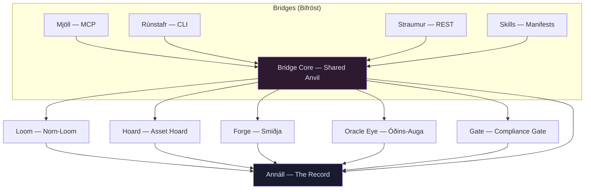

# Seiðr-Smiðja — Domain Map
**Last updated:** 2026-05-06
**Scope:** All named domains — ownership, contracts, dependencies, and invariants.
**Keeper:** Rúnhild Svartdóttir (Architect)
**Legend:** `→` means "may call into". `✗` means "must never call into".

---

> *A seam is not a weakness. A seam is where you can cut without bleeding the whole.*

---

## The Dependency Law

**Dependencies flow in one direction only, from the outermost layer inward:**

```
Bridges → Loom → Forge → Oracle Eye → Gate → Annáll
```

> **Correction (2026-05-06):** The complete pipeline order — including the Hoard which the Mermaid diagram below correctly shows — is `Bridges → Loom → Hoard → Forge → Oracle Eye → Gate → Annáll`. The Core dispatcher calls each domain in this order; Annáll is callable as a side-channel from any domain (per D-005). The shorthand above omits Hoard for brevity but should be read in light of this correction.

No domain may import from a domain that depends on it. Circular imports are a forge-fire turned inward — they consume the structure. Any domain may import from Annáll (logging is ambient). No domain other than Bridges may import from Bridges.

This law is enforced by architecture, not convention. If a dependency needs to cross the seam in the other direction, the answer is always a callback, an event, or a data structure passed as a parameter — not an import.

---

## Domain Definitions

---

### Loom — *the Norn-Loom*

**Owns:** The parametric avatar specification — its schema, its validation logic, its serialization to and from YAML/JSON, and the `extensions` field for cross-project integration.

**Does not own:** Anything that touches Blender, file system writes to output paths, render logic, compliance rules, or agent protocol parsing.

**Public contract:** Accepts raw dict or YAML/JSON input; returns a validated, typed `AvatarSpec` model or raises `LoomValidationError`. Provides `spec.to_yaml()`, `spec.to_json()`, and `spec.from_file(path)`. The `extensions` field is opaque to the Loom — it stores and round-trips it faithfully without interpreting it.

> **Implementation note (2026-05-06):** The call shape `spec.from_file(path)` above describes the conceptual pattern; the actual public functions are `load_spec(path: Path) -> AvatarSpec` and `load_and_validate(path: Path) -> AvatarSpec` (alias). There is no instance method `from_file` on the `AvatarSpec` model — loading is always through module-level functions. See `src/seidr_smidja/loom/loader.py` and `src/seidr_smidja/loom/INTERFACE_AMENDMENT_2026-05-06.md`.

**Dependencies:** None within the forge. May depend on `pydantic` and `pyyaml` as third-party libraries. May write to Annáll for validation event logging.

**Invariants:**
1. A `LoomValidationError` is raised for any spec that fails schema validation — it is never silently coerced into a partial object.
2. The `extensions` field is always preserved on round-trip, even if its schema evolves.
3. No Loom module imports from Forge, Oracle Eye, Gate, Bridges, or Hoard.

---

### Hoard — *the Asset Hoard*

**Owns:** The catalog and retrieval of static base assets — VRoid template `.vrm` files, hair meshes, outfit meshes, texture sets, and preset collections. Owns the fetch/cache contract for assets not bundled in the repository.

**Does not own:** Modification, transformation, or validation of assets. The Hoard is read-only during a build; it lends, it never alters.

**Public contract:** Provides `hoard.resolve(asset_id: str) -> Path` — returns an absolute (at runtime, resolved from a portable root) path to the requested asset, fetching and caching if necessary. Raises `AssetNotFoundError` if the asset cannot be resolved. Provides `hoard.list_assets(filter: AssetFilter) -> list[AssetMeta]` for spec-authoring tooling.

**Dependencies:** Annáll (for cache/fetch event logging). No other forge domain.

**Invariants:**
1. The Hoard never modifies any file it returns a path to.
2. Asset paths are always resolved relative to a configurable root — never hardcoded.
3. A missing asset raises `AssetNotFoundError` immediately, not a silent `None`.

---

### Forge — *the Smiðja*

**Owns:** All Blender subprocess orchestration — launching Blender in headless mode, injecting the build script, passing the spec and base-asset path as parameters, collecting the output `.vrm` path and exit status, and structured error capture from the Blender subprocess.

**Does not own:** Avatar specification schema (that is the Loom), asset resolution (that is the Hoard), render camera setup (that is Oracle Eye), compliance checking (that is the Gate), or agent protocol handling (that is Bridges).

**Public contract:** `forge.build(spec: AvatarSpec, base_asset: Path, output_dir: Path) -> ForgeResult`. `ForgeResult` carries the path to the output `.vrm`, the Blender exit code, and any structured stderr captured. Raises `ForgeBuildError` on non-recoverable failure.

**Dependencies:** Loom (consumes `AvatarSpec`), Hoard (receives resolved `Path` from caller), Annáll (build event logging).

**Invariants:**
1. Blender is never invoked inline (in-process). It is always a subprocess — isolation is non-negotiable.
2. The path to the Blender executable is always resolved through the configuration layer (env var `BLENDER_PATH` → config file → platform default) — never hardcoded.
3. Every Blender subprocess invocation is logged to Annáll with its full argument list, exit code, and captured output.
4. A `ForgeResult` is always returned — success or failure, never an unhandled exception from the subprocess layer itself.

---

### Oracle Eye — *Óðins-Auga*

**Owns:** Render orchestration — setting up cameras in Blender (or a compatible headless renderer), producing the standard set of preview PNGs (front, three-quarter, side, face close-up, T-pose, signature expressions), and returning their paths.

**Does not own:** The Blender subprocess abstraction itself (Oracle Eye uses the same subprocess pattern but owns only the render-specific scripts, not the generic runner). Avatar spec schema. Compliance logic. Agent protocol.

**Public contract:** `oracle_eye.render(vrm_path: Path, output_dir: Path, views: list[RenderView] | None = None) -> RenderResult`. If `views` is None, the full standard set is rendered. `RenderResult` carries a dict of `{view_name: Path}` for each rendered PNG, plus metadata (renderer used, resolution). Raises `RenderError` on failure.

**Dependencies:** Annáll (render event logging). Receives `vrm_path` from the Forge result — it does not call into Forge directly.

**Invariants:**
1. The Oracle Eye may never be skipped in a compliant build that produces a `.vrm` output (Sacred Principle 2 — The Oracle Eye Is Never Closed).
2. All rendered PNGs are written to the specified output directory, never to a hardcoded path.
3. The render interface is defined to accommodate a secondary renderer (e.g., headless `three-vrm`) — the `RenderView` model must not embed Blender-specific assumptions in its public schema.

---

### Gate — *the Compliance Gate*

**Owns:** All compliance validation logic — VRChat rules (polygon budgets, bone structure, viseme coverage, material count, texture size limits) and VTube Studio rules (VRM spec version, expression/blendshape coverage, lookat configuration). Owns the structured `ComplianceReport` format.

**Does not own:** Avatar transformation, rendering, logging beyond compliance events, or spec validation (that belongs to the Loom).

**Public contract:** `gate.check(vrm_path: Path, targets: list[ComplianceTarget] | None = None) -> ComplianceReport`. `ComplianceReport` contains a pass/fail verdict per target, a list of violations with field paths and human-readable descriptions, and a severity level per violation. Raises `GateError` only on internal failure (corrupt VRM, missing file) — validation failures are expressed as a failed `ComplianceReport`, not as exceptions.

**Dependencies:** Annáll (compliance event logging). Receives `vrm_path` only — no import from Forge, Oracle Eye, Loom, or Bridges.

**Invariants:**
1. A non-passing `ComplianceReport` is never silently converted to a pass.
2. The Gate can be run independently of the forge pipeline (standalone compliance check).
3. Compliance rules are defined in YAML data files, never hardcoded in Python.

---

### Bridges — *the Bifröst Bridges*

**Owns:** All agent-facing protocol translation — receiving an agent's build request in whatever protocol form it arrives (MCP, CLI, REST, skill invocation), translating it into a normalized `BuildRequest`, calling the shared Bridge Core, and translating the `BuildResponse` back into the protocol's native form.

**Does not own:** Any forge logic whatsoever. Bridges do not touch Blender, do not parse VRM files, do not run compliance checks. A Bridge that contains forge logic is a Bridge that has fallen into the fire.

**Public contract (each Bridge sub-module):** Exposes a protocol-appropriate entry point. All sub-modules delegate to `bridges.core.dispatch(request: BuildRequest) -> BuildResponse` — this is the single shared seam.

**Dependencies:** Bridge Core (internal, always). Loom (for spec parsing from raw input). Annáll (request/response logging).

**Invariants:**
1. Every Bridge sub-module (Mjöll, Rúnstafr, Straumur, Skills) must call only through `bridges.core.dispatch` — no Bridge may call Forge, Oracle Eye, Gate, or Hoard directly.
2. Protocol-specific logic (MCP message framing, CLI argument parsing, HTTP routing, skill manifest schema) is confined entirely within the Bridge sub-module and never leaks into the core.
3. A `BuildRequest` constructed by any Bridge must be semantically equivalent to the same logical request arriving through any other Bridge.

---

### Bridge Core — *the Shared Anvil* (sub-domain within Bridges)

**Owns:** The single orchestration path shared by all four Bridge sub-forms — receiving a normalized `BuildRequest`, calling Loom to validate the spec, calling Hoard to resolve the base asset, calling Forge to build, calling Oracle Eye to render, calling Gate to validate, and assembling the `BuildResponse`. Owns the `BuildRequest` and `BuildResponse` data models.

**Does not own:** Protocol translation (that belongs to each Bridge sub-module). Any forge-internal logic.

**Public contract:** `core.dispatch(request: BuildRequest) -> BuildResponse`. `BuildRequest` carries: spec (raw dict or path), base asset id, output directory, requested render views, compliance targets, and metadata. `BuildResponse` carries: vrm_path, render_paths, compliance_report, annall_session_id, timing, and errors if any.

**Dependencies:** Loom, Hoard, Forge, Oracle Eye, Gate, Annáll — in that order, with no skipping.

**Invariants:**
1. The pipeline order is fixed: Loom → Hoard → Forge → Oracle Eye → Gate. Steps may not be reordered.
2. A failure at any step produces a structured `BuildResponse` with error detail — it does not propagate as an unhandled exception to the Bridge caller.
3. The Core has no awareness of which Bridge called it.

---

### Annáll — *the Record*

**Owns:** The persistence and retrieval of all forge events — build requests, render events, compliance results, agent invocations, errors, and session metadata. Provides the session log and the historical query interface.

**Does not own:** Business logic, spec validation, asset management, or any forge operation. Annáll is a passive witness, not an actor.

**Public contract (the `AnnallPort`):** All callers interact exclusively with the `AnnallPort` abstract interface:
- `annall.open_session(metadata: dict) -> SessionID`
- `annall.log_event(session_id: SessionID, event: AnnallEvent) -> None`
- `annall.close_session(session_id: SessionID, outcome: SessionOutcome) -> None`
- `annall.query_sessions(filter: SessionFilter) -> list[SessionSummary]`
- `annall.get_session(session_id: SessionID) -> SessionRecord`

The concrete `SQLiteAnnallAdapter` implements this port. Future adapters (Postgres, flat-file) implement the same port without callers changing.

**Dependencies:** None within the forge. Depends only on its configured storage backend.

**Invariants:**
1. All callers use only the `AnnallPort` interface — never the `SQLiteAnnallAdapter` directly.
2. Annáll never raises an exception to its callers for a logging failure. It swallows storage errors silently and continues — forge operations must never fail because the record-keeper stumbled.
3. The database file is always located through the configuration layer, never at a hardcoded path.
4. No forge domain may import from Annáll's adapter layer — only from the port.

---

## Domain Dependency Diagram



**ASCII fallback for environments without Mermaid:**

```
[Mjöll] [Rúnstafr] [Straumur] [Skills]
    \         |         |         /
     \        |         |        /
      \       v         v       /
       +---> [Bridge Core] <---+
                    |
        +-----------+-----------+
        |           |           |
        v           v           v
     [Loom]      [Hoard]     [Forge]
        |                       |
        |                       v
        |                 [Oracle Eye]
        |                       |
        |                       v
        |                    [Gate]
        |
        +---all domains log to---> [Annáll]
```

**Forbidden directions (any arrow pointing upward in the diagram above is a build error):**
- Loom must not import Forge, Oracle Eye, Gate, Bridges, or Hoard.
- Forge must not import Oracle Eye, Gate, or Bridges.
- Oracle Eye must not import Gate or Bridges.
- Gate must not import Bridges.
- Annáll must not import any forge domain.
- No sub-module of Bridges (Mjöll, Rúnstafr, Straumur, Skills) may import any forge domain except through Bridge Core.

---

*Drawn at the second founding fire, 2026-05-06.*
*Rúnhild Svartdóttir, Architect — for Volmarr Wyrd.*
