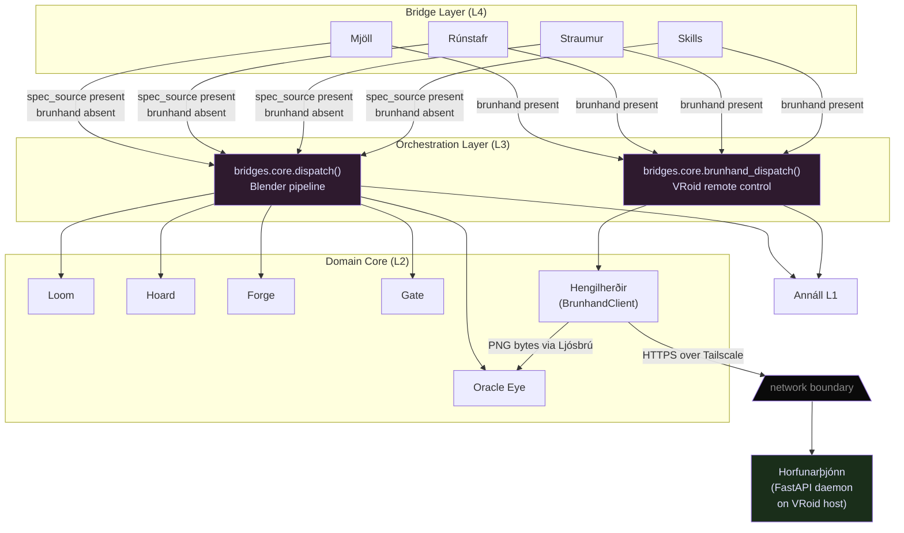

# Brúarhönd — Architecture
**Last updated:** 2026-05-06
**Scope:** Feature-level structural decomposition — the cross-machine VRoid Studio remote-control bridge
**Keeper:** Rúnhild Svartdóttir (Architect) — ratified by Volmarr Wyrd
**Legend:** `→` means "may call into". `✗` means "must never call into". `||` marks a network boundary.

---

> *The bridge is not part of the pipeline. The bridge is beside the pipeline — a parallel arm that reaches where the headless forge cannot. Both arms belong to the same smith.*

---

## I. How Brúarhönd Sits in the Layered Model

The existing system has four architectural layers (documented in `docs/ARCHITECTURE.md §I`):

```
┌─────────────────────────────────────────────────────────────────────┐
│  LAYER 4 — Bridge Layer                                             │
│  Mjöll · Rúnstafr · Straumur · Skills                              │
│  Protocol translation only — no forge logic                         │
├─────────────────────────────────────────────────────────────────────┤
│  LAYER 3 — Orchestration Layer                                      │
│  Bridge Core (Shared Anvil)      Brúarhönd Client (Hengilherðir)   │
│  dispatch()                       brunhand_dispatch()               │
│  ← pipeline builds →              ← GUI remote control →           │
├─────────────────────────────────────────────────────────────────────┤
│  LAYER 2 — Domain Core                                              │
│  Loom · Hoard · Forge · Oracle Eye · Gate                           │
│  Each domain owns one pure capability                               │
├─────────────────────────────────────────────────────────────────────┤
│  LAYER 1 — Adapter / Infrastructure Layer                           │
│  Annáll (AnnallPort + SQLiteAnnallAdapter)                          │
│  Config loader · Blender subprocess runner                          │
│                                                                     │
│  ║ NETWORK BOUNDARY (Tailscale / localhost) ║                       │
│                                                                     │
│  Horfunarþjónn (Daemon) — its own Layer 1 on the VRoid host         │
│  FastAPI · PyAutoGUI · MSS · pygetwindow · accessibility libs       │
└─────────────────────────────────────────────────────────────────────┘
```

Brúarhönd occupies **two separate runtime contexts:**

1. **Hengilherðir (client)** — lives in Layer 3 of the forge process, beside Bridge Core. It is not inside the Loom→Hoard→Forge→Eye→Gate pipeline. It is a parallel dispatch surface.

2. **Horfunarþjónn (daemon)** — lives in a wholly separate process on the VRoid host machine. It is not part of any forge layer. It is its own small layered system, visible to the forge only as an HTTPS endpoint.

---

## II. The Dispatch Seam — Resolution of the Placement Tension

### The Tension

Brúarhönd can be invoked:
- **Instead of** `dispatch()` — agent wants VRoid Studio GUI control, no Blender involved.
- **Alongside** `dispatch()` — agent wants a Blender build and then VRoid refinement in one request.
- **Standalone** — agent calls a single primitive (screenshot, click) with no Loom spec.

None of these patterns fit cleanly inside `dispatch()`'s fixed pipeline (Loom→Hoard→Forge→Eye→Gate). Inserting a conditional branch for Brúarhönd into `dispatch()` would:
- Break the pipeline's invariant (fixed order, no skipping).
- Pollute Bridge Core with awareness of a capability that is not part of the Blender build cycle.
- Make the pipeline's single-responsibility impossible to state in one sentence.

### The Pattern: Parallel Dispatch Surface

**`brunhand_dispatch(request, annall, client, config)` is a sibling function to `dispatch()` within Bridge Core, NOT a branch inside `dispatch()`.**

```
bridges.core.dispatch()             bridges.core.brunhand_dispatch()
  Loom → Hoard → Forge               Hengilherðir session open
  → Oracle Eye → Gate                → primitive(s) executed
  → BuildResponse                    → screenshot → Ljósbrú → Oracle Eye
                                     → BrunhandResponse
```

Both functions:
- Are called by Bridge sub-modules (Mjöll, Rúnstafr, Straumur, Skills).
- Log through Annáll (same `AnnallPort` instance, injected as parameter).
- Respect the dependency law (Bridges → Layer 3 → Layer 1; no upward calls).
- Return structured responses; never propagate unhandled exceptions to callers.

### The Dispatch Decision Rule

A Bridge sub-module inspects the incoming request and calls the appropriate function:

```
IF request.brunhand is None AND request.spec_source is present
    → call bridges.core.dispatch()           # standard Blender build

IF request.brunhand is not None AND request.spec_source is None
    → call bridges.core.brunhand_dispatch()  # VRoid remote control only

IF request.brunhand is not None AND request.spec_source is present
    → call bridges.core.dispatch() THEN bridges.core.brunhand_dispatch()
      sharing the same annall session_id for cross-correlation
      (sequential; the build completes before the remote control begins)
```

**The rule in one sentence:** *When `request.brunhand` is present, call `brunhand_dispatch()`; when it is absent, call `dispatch()`; when both are present, call both in sequence under a shared `run_id`.*

### The `BrunhandRequest` Model (Bridge-level)

```python
@dataclass
class BrunhandRequest:
    host: str                          # Tailscale host or "localhost"
    primitives: list[PrimitiveCall]    # Ordered sequence of primitive calls
    session_id: str | None             # Resume existing session (optional)
    agent_id: str                      # For Annáll correlation
    request_id: str                    # UUID, assigned by Bridge sub-module
    run_id: str | None                 # Set to dispatch() run_id for combined requests
```

### The `BrunhandResponse` Model (Bridge-level)

```python
@dataclass
class BrunhandResponse:
    request_id: str
    success: bool
    results: list[PrimitiveResult]     # One per PrimitiveCall in request
    annall_session_id: str
    elapsed_seconds: float
    errors: list[BrunhandError]
```

### Mermaid Diagram — Dispatch Seam



---

## III. The Daemon (Horfunarþjónn) — Internal Structure

Horfunarþjónn is a FastAPI application that runs as a standalone process on the VRoid Studio host machine. It is the far end of the bridge.

### Daemon Layer Model

```
┌────────────────────────────────────────────────┐
│  HTTP Server Layer                             │
│  FastAPI + uvicorn                             │
│  Bind: 127.0.0.1 (default) or Tailscale addr  │
├────────────────────────────────────────────────┤
│  Middleware Layer (ordered)                    │
│  1. Request logging (Annáll event)             │
│  2. Gæslumaðr — bearer token validation        │
│  3. Rate limiting (optional, config-driven)    │
│  4. Request ID injection (if absent)           │
├────────────────────────────────────────────────┤
│  Router Layer                                  │
│  /v1/brunhand/health       (no-auth GET)       │
│  /v1/brunhand/capabilities (auth GET)          │
│  /v1/brunhand/{primitive}  (auth POST)         │
│  /v1/brunhand/vroid/*      (auth POST)         │
├────────────────────────────────────────────────┤
│  Primitive Execution Layer                     │
│  Sjálfsmöguleiki — capabilities check          │
│  PyAutoGUI + MSS + pygetwindow dispatch        │
│  Platform-conditional accessibility libs       │
├────────────────────────────────────────────────┤
│  Adapter Layer                                 │
│  Annáll (local SQLite instance)                │
│  Config loader (env var → YAML → defaults)     │
└────────────────────────────────────────────────┘
```

### Middleware Order

Middleware executes in stack order (outermost first):

1. **Request logging** — writes an `AnnallEvent` with timestamp, method, path, and source IP before any handler runs. Runs even for unauthenticated requests (so rejected requests are still recorded).
2. **Gæslumaðr** — validates `Authorization: Bearer <token>`. Rejects with `401` if absent or invalid. Never executes a primitive before this check passes. The token is compared using `hmac.compare_digest()` to prevent timing attacks.
3. **Rate limiting** — configurable via `brunhand.rate_limit` in daemon config. Default: no limit. When enabled: per-source-IP token bucket. Returns `429 Too Many Requests` when exceeded.
4. **Request ID injection** — if `X-Request-ID` header is absent, generates a UUID and attaches it. Returned in the response.

**Note on health endpoint:** `GET /v1/brunhand/health` is the only endpoint that bypasses Gæslumaðr. It returns daemon version, uptime, and OS — but no desktop access, no capability details, and no mutable state. This is a conscious and bounded exception documented explicitly here. The unbreakable vow "never without a valid bearer token" applies to all primitives — `health` is a readiness probe, not a primitive.

### Endpoint Groups

```
/v1/brunhand/health          GET   — heartbeat, no auth required
/v1/brunhand/capabilities    GET   — platform manifest, auth required
/v1/brunhand/screenshot      POST  — capture screen or region
/v1/brunhand/click           POST  — mouse click
/v1/brunhand/move            POST  — mouse move
/v1/brunhand/drag            POST  — mouse drag
/v1/brunhand/scroll          POST  — scroll wheel
/v1/brunhand/type            POST  — type text string
/v1/brunhand/hotkey          POST  — key combination
/v1/brunhand/find_window     POST  — find window by title/pattern
/v1/brunhand/wait_for_window POST  — block until window appears
/v1/brunhand/vroid/export_vrm    POST  — drive VRoid export flow
/v1/brunhand/vroid/save_project  POST  — save .vroid project
/v1/brunhand/vroid/open_project  POST  — open .vroid project
```

### Shared Envelope Fields

Every authenticated POST endpoint accepts an envelope with these universal fields alongside primitive-specific parameters:

```python
class BrunhandEnvelope(BaseModel):
    request_id: str        # UUID supplied by caller; echoed in response
    session_id: str        # Tengslastig session identifier for log correlation
    agent_id: str          # Agent identity string for Annáll
```

Every response wraps its payload in:

```python
class BrunhandResponseEnvelope(BaseModel):
    request_id: str        # Echoed from request
    session_id: str        # Echoed from request
    success: bool
    payload: dict          # Primitive-specific result data
    error: BrunhandErrorDetail | None
    daemon_timestamp: str  # ISO 8601 UTC
    latency_ms: float
```

---

## IV. The Client (Hengilherðir) — Internal Structure

Hengilherðir is the client-side library that lives within the forge process. It manages one or more HTTP connections to remote Horfunarþjónn instances.

### Class Architecture

```
seidr_smidja.brunhand.client
├── BrunhandClient                — low-level: one method per primitive endpoint
├── Tengslastig (session.py)      — context manager wrapping BrunhandClient
├── Ljósbrú (oracle_channel.py)   — PNG → Oracle Eye pipeline adapter
└── exceptions.py                 — exception hierarchy (shared with daemon side)
```

### `BrunhandClient`

- Constructor: `BrunhandClient(host: str, token: str, timeout: float, config: BrunhandConfig)`
- Holds an `httpx.Client` (sync) or `httpx.AsyncClient` (async) — v0.1 provides sync; async variant is future.
- One method per primitive, each returning a typed `PrimitiveResult` subclass.
- On HTTP 4xx/5xx: raises typed `BrunhandError` subclass (see exceptions hierarchy below).
- On connection failure: raises `BrunhandConnectionError`.
- On token rejection (401): raises `BrunhandAuthError`.
- On timeout: raises `BrunhandTimeoutError`.
- On capabilities mismatch reported by daemon: raises `BrunhandCapabilitiesError`.

### `Tengslastig` — Session Context Manager

`Tengslastig` is the primary user-facing API for sequential primitive sequences.

```python
with brunhand.session(host="vroid-host.tailnet.ts.net", annall=annall_port) as sess:
    sess.screenshot()                     # returns ScreenshotResult + feeds Ljósbrú
    sess.click(x=412, y=288)
    result = sess.execute_and_see(sess.click, x=500, y=300)
    # result.primitive_result + result.screenshot (auto-captured after action)
```

State held by a `Tengslastig` session:
- `host` — target host
- `token` — bearer token (from config; never logged)
- `capabilities` — cached `CapabilitiesManifest` (fetched on first call, refreshable)
- `session_id` — unique session UUID; threaded into every request envelope
- `run_id` — optional, set by caller to correlate with a `dispatch()` `BuildResponse`
- `command_log` — ordered list of `(primitive_name, args, result)` for replay/audit
- `annall` — injected `AnnallPort` for forge-side logging

Session opening: probes `GET /v1/brunhand/capabilities` and caches the result. Refuses to open if daemon is unreachable.

Session closing: logs a session-close event to Annáll with final status and command count. Releases the HTTP connection.

### `execute_and_see()`

`execute_and_see(primitive_fn, *args, **kwargs) -> ExecuteAndSeeResult` is a session-level composite operation:

1. Executes the primitive.
2. Immediately calls `screenshot()`.
3. Feeds the screenshot bytes to Ljósbrú.
4. Returns both results as `ExecuteAndSeeResult(primitive_result, screenshot_result)`.

This is the primary mechanism through which agents close their perception loop after any state-affecting action.

### Retry and Timeout Policy

Defaults (all configurable in `config/defaults.yaml` under `brunhand.client`):

```yaml
brunhand:
  client:
    timeout_seconds: 30.0         # Per-request timeout
    connect_timeout_seconds: 5.0  # Connection establishment timeout
    retry_max: 3                  # Max retries on transient failures
    retry_backoff_base: 0.5       # Exponential backoff base in seconds
    retry_on: [500, 502, 503]     # HTTP status codes triggering retry
```

Retries are NOT performed on: 401 (auth failure), 400 (bad request), 422 (validation error), 503 with `X-Brunhand-VRoid-Down: true` header. These signal conditions that retrying cannot fix.

### Exception Hierarchy

```
BrunhandError                         — base class; all Brúarhönd exceptions
├── BrunhandConnectionError           — daemon unreachable (network, Tailscale partition)
├── BrunhandAuthError                 — 401; token rejected
├── BrunhandTimeoutError              — request timed out
├── BrunhandCapabilitiesError         — daemon reported primitive unsupported on its platform
├── BrunhandPrimitiveError            — daemon executed primitive but it raised an OS-level error
│   └── VroidNotRunningError          — specific: VRoid Studio process not detected
└── BrunhandProtocolError             — unexpected response shape; version mismatch
```

---

## V. Authentication Architecture (Gæslumaðr)

### Token Loading at Daemon Startup

Priority order (first match wins):

1. Environment variable `BRUNHAND_TOKEN` (string value).
2. `config/user.yaml` key `brunhand.daemon.token` (path to a token file, or inline value).
3. `config/defaults.yaml` key `brunhand.daemon.token_path` (path to a file containing the token).
4. **Fail-loud:** If none of the above resolves to a non-empty string, the daemon refuses to start with a clear error message: `BRUNHAND_TOKEN is not set. The daemon will not start without a bearer token.`

The token is **never** written to any log, trace, response body, or Annáll event. It is held in memory only. Log entries that reference auth use the string `[REDACTED]` in the `Authorization` field.

### Request Validation

`Gæslumaðr` compares the received token against the configured token using `hmac.compare_digest()` to prevent timing-based token inference attacks. The comparison is constant-time regardless of where the first differing character appears.

### Tailscale as Outer Layer

Tailscale ACL rules restrict which tailnet identities may reach port 8848 on the VRoid host. This is documented in `docs/features/brunhand/TAILSCALE.md`. Brúarhönd does not enforce or verify Tailscale membership — that is Tailscale's domain. The bearer token is the inner wall; Tailscale ACL is the outer wall. Neither replaces the other.

### Token Rotation

v0.1 does not implement automatic rotation. The operator rotates manually:
1. Update `BRUNHAND_TOKEN` env var on both the daemon host and in the forge's config.
2. Restart the daemon (`python -m seidr_smidja.brunhand.daemon --reload`).
3. Old tokens are immediately invalid after restart.

A future v0.2 rotation strategy (e.g., time-limited JWTs, TOTP-based tokens) slots into Gæslumaðr without changing any caller.

---

## VI. Capabilities Probe (Sjálfsmöguleiki)

### Startup Probing

On daemon startup, `Sjálfsmöguleiki` probes the current runtime environment and assembles a `CapabilitiesManifest`:

```python
class CapabilitiesManifest(BaseModel):
    daemon_version: str
    os_name: str                        # "windows", "linux", "darwin"
    os_version: str
    screen_geometry: list[ScreenRect]   # One entry per monitor
    primitives: dict[str, PrimitiveStatus]
    probed_at: str                      # ISO 8601 UTC

class PrimitiveStatus(BaseModel):
    available: bool
    library: str                        # Which library provides this primitive
    degraded: bool                      # True if available but with known limitations
    degraded_reason: str | None
    notes: str | None
```

### Platform-Conditional Primitives

Some primitives have platform-conditional availability:

| Primitive | Windows | macOS | Linux |
|---|---|---|---|
| `screenshot` | MSS (full) | MSS (full) | MSS (full, X11 only; Wayland limited) |
| `click` | PyAutoGUI | PyAutoGUI | PyAutoGUI (X11 only) |
| `move` | PyAutoGUI | PyAutoGUI | PyAutoGUI |
| `drag` | PyAutoGUI | PyAutoGUI | PyAutoGUI |
| `scroll` | PyAutoGUI | PyAutoGUI | PyAutoGUI |
| `type_text` | PyAutoGUI | PyAutoGUI | PyAutoGUI |
| `hotkey` | PyAutoGUI | PyAutoGUI | PyAutoGUI |
| `find_window` | pygetwindow | pygetwindow (limited) | `wmctrl` subprocess |
| `wait_for_window` | pygetwindow | pygetwindow | `wmctrl` subprocess |
| `find_window_by_accessibility` | pywinauto | pyobjc-framework-Quartz + Accessibility perms | pyatspi |

Sjálfsmöguleiki reports degraded state when, for example:
- macOS Accessibility permissions have not been granted (accessibility primitives degrade).
- Linux Wayland session detected (screenshot and input primitives degrade — only X11 supported in v0.1).

### Client-Side Use

The Tengslastig session caches the `CapabilitiesManifest` on open. Before calling any primitive, the client checks `session.capabilities.primitives[primitive_name].available`. If `False`, `BrunhandCapabilitiesError` is raised locally without a network round-trip.

---

## VII. Vision Integration (Ljósbrú)

### The Oracle Eye Extension Point

Oracle Eye currently exposes: `oracle_eye.render(vrm_path, output_dir, views) -> RenderResult`.

Brúarhönd requires a second entry point: registering externally-sourced PNG bytes as a named render, so the agent sees them through the same channel.

**The new Oracle Eye API surface Ljósbrú calls:**

```python
oracle_eye.register_external_render(
    source: str,               # "brunhand"
    view: str,                 # "live/{session_id}/{timestamp}"
    png_bytes: bytes,
    metadata: ExternalRenderMetadata
) -> ExternalRenderResult
```

```python
class ExternalRenderMetadata(BaseModel):
    host: str
    session_id: str
    agent_id: str
    captured_at: str           # ISO 8601 UTC from daemon
    screen_geometry: ScreenRect | None
```

```python
class ExternalRenderResult(BaseModel):
    view_path: Path | None     # Written to output_dir if configured; None if in-memory only
    view_name: str             # Canonical name: "brunhand/live/{session_id}/{timestamp}"
    png_bytes: bytes           # Echoed back for immediate use
```

**What this API surface does NOT require:** modifying the existing `render()` function, changing `RenderView`, or altering `RenderResult`. The `register_external_render()` function is a new addition to `oracle_eye/__init__.py` — additive, non-breaking.

### Ljósbrú's Role

`Ljósbrú` (in `brunhand/client/oracle_channel.py`) is the adapter that translates a daemon screenshot response into an `oracle_eye.register_external_render()` call:

```
daemon response (BrunhandResponseEnvelope with png_bytes in payload)
    → Ljósbrú.feed(response, session)
    → oracle_eye.register_external_render(source="brunhand", view=..., png_bytes=..., metadata=...)
    → ExternalRenderResult (returned to caller)
```

Ljósbrú holds a reference to the `oracle_eye` module (injected at session creation). It never constructs its own render pipeline — it speaks to Oracle Eye through the single documented entry point.

---

## VIII. Session Pattern (Tengslastig)

The context manager API (full signature):

```python
def session(
    host: str,
    token: str | None = None,         # If None, loaded from config
    timeout: float | None = None,     # If None, loaded from config
    run_id: str | None = None,        # For dispatch() cross-correlation
    annall: AnnallPort | None = None, # If None, Annáll logging disabled
    oracle_eye_module = None,         # Injected for Ljósbrú; if None, vision disabled
) -> ContextManager[Tengslastig]:
    ...
```

State the session holds across its lifetime:

| Field | Type | Purpose |
|---|---|---|
| `host` | `str` | Target daemon address |
| `token` | `str` | Bearer token (in-memory only, never logged) |
| `capabilities` | `CapabilitiesManifest` | Cached on session open |
| `session_id` | `str` | UUID; threaded into every request |
| `run_id` | `str \| None` | Links to a `dispatch()` run for Annáll correlation |
| `command_log` | `list[CommandRecord]` | Ordered record for replay/audit |
| `annall` | `AnnallPort \| None` | Forge-side logging |
| `_client` | `BrunhandClient` | Underlying HTTP client |
| `_ljosbrú` | `Ljósbrú \| None` | Vision adapter |

On `__enter__`: open session, probe capabilities, log `brunhand.session.opened` to Annáll.
On `__exit__`: log `brunhand.session.closed` with outcome and command count; close HTTP client.

---

## IX. Cross-Platform Stance

### Daemon Platform Matrix

| Concern | Windows | macOS | Linux |
|---|---|---|---|
| Input automation | `pyautogui` (Win32 backend) | `pyautogui` (Quartz backend) | `pyautogui` (X11/xdotool backend) |
| High-perf screenshot | `mss` (Win32 GDI) | `mss` (Quartz) | `mss` (X11 XShm) |
| Window discovery | `pygetwindow` (Win32) | `pygetwindow` (limited; Quartz fallback) | `wmctrl` subprocess |
| Accessibility tree | `pywinauto` | `pyobjc-framework-Quartz` + Accessibility perms | `pyatspi` (AT-SPI) |
| VRoid detection | `psutil.process_iter()` | `psutil.process_iter()` | `psutil.process_iter()` |
| Wayland support | n/a | n/a | Wayland: screenshot/input unsupported in v0.1 |

Platform detection at daemon startup uses `sys.platform` (`win32`, `darwin`, `linux`). Platform-conditional import blocks are isolated in `brunhand/daemon/platform.py` — never scattered across handler code.

### Client Platform

`Hengilherðir` requires only `httpx` and `pydantic`. It has no platform-conditional code. It runs identically on all three OS environments.

---

## X. Network Stance

### Transport Modes

| Scenario | Transport | TLS | Auth |
|---|---|---|---|
| Forge and daemon on same machine | HTTP to `127.0.0.1:8848` | None (loopback) | Bearer token |
| Forge and daemon on different Tailscale nodes | HTTPS to `<host>.tailnet.ts.net:8848` | Self-signed cert acceptable (Tailscale E2E) | Bearer token |
| Any other topology | Not supported in v0.1 | — | — |

### TLS Configuration

When HTTPS is configured, the daemon loads its TLS certificate and key from:
- `BRUNHAND_TLS_CERT_PATH` env var (path to PEM cert)
- `BRUNHAND_TLS_KEY_PATH` env var (path to PEM key)
- Or via `brunhand.daemon.tls_cert` / `brunhand.daemon.tls_key` in config YAML.

Self-signed certificates are acceptable in the Tailscale-internal deployment because Tailscale provides E2E encryption at the network layer. The bearer token provides application-level authentication regardless of TLS validity.

The client accepts self-signed certificates when `brunhand.client.verify_ssl: false` is set in config (default: `true`). When disabled, a startup warning is logged via Annáll.

### Default Port

`8848` — configurable via `BRUNHAND_PORT` env var or `brunhand.daemon.port` in config.

### Tailscale Trust Boundary

Tailscale's ACL rules define which tailnet identities may reach the daemon. The daemon does not inspect or verify Tailscale identity — it trusts the network-level ACL and adds the bearer token as its own application-level wall. See `docs/features/brunhand/TAILSCALE.md` for recommended ACL configuration.

---

## XI. Failure Model

### Daemon-Side Failures

| Failure | Response |
|---|---|
| Primitive raised an OS exception | `BrunhandPrimitiveError` with exception summary; daemon stays alive |
| OS denied desktop access (permissions) | `BrunhandPrimitiveError` with `permission_denied=true` |
| VRoid Studio not detected as foreground | `BrunhandPrimitiveError` with `vroid_running=false` |
| Screen locked or session disconnected | `BrunhandPrimitiveError` with `screen_accessible=false` |
| Primitive not supported on this platform | `capabilities_error` (before primitive executed) |
| Internal daemon error (unhandled exception) | HTTP 500 with structured error body; daemon continues |

**Invariant:** The daemon process itself never crashes due to a primitive failure. `try/except` wraps every primitive handler. A crashed daemon must be a Python-level exception in FastAPI or uvicorn, not in Brúarhönd handler code.

### Client-Side Failures

| Failure | Exception |
|---|---|
| Tailscale partition / daemon unreachable | `BrunhandConnectionError` |
| Daemon down (refused connection) | `BrunhandConnectionError` |
| Bearer token rejected | `BrunhandAuthError` |
| Request timed out | `BrunhandTimeoutError` |
| Daemon reports primitive unsupported | `BrunhandCapabilitiesError` |
| Daemon returned unexpected response shape | `BrunhandProtocolError` |
| Daemon executed primitive but OS raised | `BrunhandPrimitiveError` |
| VRoid Studio not running | `VroidNotRunningError` (subclass of `BrunhandPrimitiveError`) |

All exceptions carry: `host`, `primitive`, `request_id`, `session_id`, and a human-readable `message`. They never carry the bearer token.

---

## XII. Concurrency Model

### Daemon Concurrency

The daemon is designed for **one active session at a time**. This reflects the physical reality: one VRoid Studio instance, one desktop, one mouse cursor.

If a second session request arrives while a session is active:
- Default (v0.1): `423 Locked` with `X-Brunhand-Session-Active: <session_id>`.
- Alternative (configurable): queue and serialize (v0.2 optional enhancement).

Multiple distinct hosts each run their own daemon independently. The forge client can hold `BrunhandClient` instances for multiple hosts simultaneously — one `Tengslastig` session per host.

### Forge-Side Concurrency

Hengilherðir is stateless at the module level. Multiple `Tengslastig` sessions pointing at different hosts can exist simultaneously in the forge process. Thread safety is the caller's responsibility — `Tengslastig` is not thread-safe by design; concurrent access to the same session requires external locking.

---

## XIII. Optional Dependency Strategy

### Install Groups

```
seidr-smidja              # Base package — no GUI dependencies
seidr-smidja[dev]         # Development tools (existing)
seidr-smidja[brunhand-daemon]   # Daemon-side GUI automation
seidr-smidja[brunhand-win]      # Windows-only accessibility (pywinauto)
seidr-smidja[brunhand-mac]      # macOS-only accessibility (pyobjc)
seidr-smidja[brunhand-linux]    # Linux-only accessibility (pyatspi)
```

**Client-side (`Hengilherðir`) requires:** only `httpx>=0.27` (already in dev deps; added to base). No GUI deps.

**Daemon-side (`Horfunarþjónn`) requires:** `pyautogui`, `mss`, `pygetwindow` (cross-platform) plus one platform-specific accessibility lib.

**Base package installs WITHOUT GUI deps.** An agent running the forge to issue Brúarhönd commands does not need PyAutoGUI installed — only the VRoid host machine does.

---

## XIV. Testing Strategy

### Unit-Testable Without VRoid Studio (mocked PyAutoGUI)

All of the following can be tested with `unittest.mock.patch("pyautogui.*")`:

- **Gæslumaðr** — bearer token validation, timing-safe comparison, reject paths.
- **Sjálfsmöguleiki** — capabilities manifest construction, platform-conditional logic.
- **All primitive handlers** — correct PyAutoGUI call arguments, response envelope shape.
- **VRoid high-level scripts** — correct primitive sequence, error propagation.
- **Hengilherðir** — HTTP request formation, retry logic, exception mapping.
- **Tengslastig** — session lifecycle, `execute_and_see()` composition, command log.
- **Ljósbrú** — PNG bytes forwarding, Oracle Eye call formation.
- **`brunhand_dispatch()`** — request routing, Annáll correlation.

### Live VRoid Host Tests

Tests requiring a real VRoid Studio session are marked:

```python
@pytest.mark.requires_vroid_host
def test_screenshot_captures_vroid_window():
    ...
```

This marker is registered in `pyproject.toml` alongside `requires_blender`. Excluded from default CI. Enabled on CI configurations with a live VRoid host provisioned.

### Fake Daemon Smoke Test

An `InProcessFakeDaemon` fixture (in `tests/brunhand/conftest.py`) spins up the FastAPI app with mocked primitive handlers. This supports end-to-end smoke tests of the full client→daemon→response→Ljósbrú→OracleEye path without any GUI automation:

```python
def test_execute_and_see_full_cycle(fake_daemon):
    with brunhand.session(host="localhost", token="test-token") as sess:
        result = sess.execute_and_see(sess.click, x=100, y=100)
        assert result.screenshot_result.success is True
```

---

## XV. Cross-References

| Document | Relationship |
|---|---|
| `docs/features/brunhand/VISION.md` | Feature soul and Primary Rite — the source of truth for what this feature is |
| `docs/features/brunhand/PHILOSOPHY_ADDENDUM.md` | Sacred principles VI–IX governing Brúarhönd |
| `docs/ARCHITECTURE.md` | System-level layer model this feature plugs into |
| `docs/DOMAIN_MAP.md` | System-level domain graph; see Brúarhönd addendum at bottom |
| `docs/DECISIONS/D-001` through `D-009` | Ratified decisions not to contradict |
| `src/seidr_smidja/brunhand/INTERFACE.md` | Top-level domain contract |
| `src/seidr_smidja/brunhand/daemon/INTERFACE.md` | Daemon HTTP API contract |
| `src/seidr_smidja/brunhand/client/INTERFACE.md` | Client Python API contract |
| `src/seidr_smidja/oracle_eye/INTERFACE.md` | Oracle Eye contract being extended by Ljósbrú |
| `docs/features/brunhand/TAILSCALE.md` | Network deployment and ACL configuration (Scribe Phase 4) |

---

*Drawn at the bridge-fire, 2026-05-06.*
*Rúnhild Svartdóttir, Architect — for Volmarr Wyrd.*
