# Brúarhönd — Data Flow
**Last updated:** 2026-05-06
**Scope:** Request flow, session lifecycle, authentication wiring, vision loop, failure flows, concurrency, and the Two-Annáll topology for the cross-machine VRoid Studio remote-control surface.
**Author:** Védis Eikleið (Cartographer)
**Keeper:** Rúnhild Svartdóttir (Architect)

**Legend:**
- `→` data or control flows into
- `⇢` Annáll side-write (logging event; does not block the main path)
- `||` network / process boundary
- `[DAEMON]` Horfunarþjónn process on VRoid host
- `[FORGE]` seidr_smidja process on Volmarr's development machine

**Cross-references:**
- [VISION.md](./VISION.md) — feature soul and Primary Rite
- [PHILOSOPHY_ADDENDUM.md](./PHILOSOPHY_ADDENDUM.md) — sacred principles VI–IX
- [ARCHITECTURE.md](./ARCHITECTURE.md) — structural decomposition, daemon layers, dispatch seam
- [../../DOMAIN_MAP.md](../../DOMAIN_MAP.md) — system-level domain graph; see Brúarhönd addendum
- [../../DATA_FLOW.md](../../DATA_FLOW.md) — project-level Blender pipeline data flow (Mode B)
- [../../../src/seidr_smidja/brunhand/INTERFACE.md](../../../src/seidr_smidja/brunhand/INTERFACE.md) — top-level domain contract
- [../../../src/seidr_smidja/brunhand/daemon/INTERFACE.md](../../../src/seidr_smidja/brunhand/daemon/INTERFACE.md) — daemon HTTP API contract
- [../../../src/seidr_smidja/brunhand/client/INTERFACE.md](../../../src/seidr_smidja/brunhand/client/INTERFACE.md) — client Python API contract

---

> *The forge has two arms now. One arm reaches into headless Blender. The other extends across the Tailscale wire into a live desktop. Both arms belong to the same smith — they share only the run_id thread that names the moment they were lifted together.*

---

## I. The Three Modes of Brúarhönd Use

Brúarhönd is invoked through any of the four Bridges (Mjöll, Rúnstafr, Straumur, Skills). The Bridge inspects the incoming request and routes to one or both dispatch arms. Three modes cover all valid combinations.

---

### Mode A — Brúarhönd Only

**Trigger:** `request.brunhand` is set; `request.spec_source` is absent.

The Bridge calls `bridges.core.brunhand_dispatch()`. The Loom→Hoard→Forge→Oracle Eye→Gate pipeline is not entered. No Blender subprocess is launched.

**Typical uses:**
- Pure GUI exploration of a VRoid Studio session already open on the host.
- Manual VRoid Studio export from an existing `.vroid` project that the agent did not create through the forge.
- Agent-as-VRoid-pilot: the agent drives the full VRoid Studio UI, primitive by primitive, with vision feedback at every step.

---

### Mode B — Forge Only

**Trigger:** `request.spec_source` is set; `request.brunhand` is absent.

The Bridge calls `bridges.core.dispatch()`. The existing Loom→Hoard→Forge→Oracle Eye→Gate pipeline runs to completion. Brúarhönd is not involved.

This mode is fully documented in [../../DATA_FLOW.md](../../DATA_FLOW.md) — the project-level data flow for the Blender pipeline. This document does not repeat that content. Cross-reference there for the complete Mode B walkthrough, sequence diagram, and failure flows.

---

### Mode C — Both Arms

**Trigger:** Both `request.spec_source` and `request.brunhand` are set.

The Bridge generates a shared `run_id` UUID at the Bridge layer — before calling either dispatch arm. It then calls both arms **sequentially**: `dispatch()` first, then `brunhand_dispatch()`. The Blender build completes before any VRoid GUI operations begin. Both Annáll sessions record the shared `run_id` in their session metadata, providing the only thread that ties the two arms together for later reconstruction.

**Sequential rationale (Architect's choice):** VRoid Studio operations in Mode C typically depend on the artifact produced by the Blender build — for example, opening the freshly-built `.vrm` in VRoid Studio for final GUI refinement before re-export. Sequential ordering ensures the Blender output is available before Brúarhönd's hand moves. Parallel execution would require the Brúarhönd request to carry no dependency on the build result, which contradicts the most common Mode C workflow.

**Typical use:**
- Complex avatar production: Blender/VRM pipeline shapes the base avatar from a Loom spec, then Brúarhönd opens the output in VRoid Studio, makes fine adjustments only possible through VRoid's native GUI (hair painting, expression sliders, texture canvas), and drives a final VRoid export of the refined avatar.

---

## II. The Primary Rite Walked — Mode A

*One complete Mode A request from agent intent to vision feedback. Every step is numbered. Each step names its owning True Name, what it receives, what it produces, and what it writes to which Annáll.*

---

### Step 1 — Agent Constructs the Brúarhönd Request

**Owner:** Agent (external to the forge)
**Receives:** Its own intent — for example, "screenshot the VRoid Studio window, then click the hair panel tab, then screenshot again."
**Produces:** A protocol-native request body carrying a `brunhand` field with `host`, `primitives` (ordered list of `PrimitiveCall` objects), and `agent_id`.
**Writes to Annáll:** Nothing. The agent is outside the forge.

---

### Step 2 — Bridge Receives and Routes

**Owner:** Bridges (Mjöll / Rúnstafr / Straumur / Skills)
**Receives:** The protocol-native invocation — an MCP tool call, a `seidr brunhand` shell command, an HTTP POST, or a skill invocation.
**Produces:**
- A `BrunhandRequest` dataclass carrying: `host`, `primitives`, `session_id` (None for a new session), `agent_id`, `request_id` (UUID minted here), `run_id` (None in Mode A — no paired dispatch call).
- Recognition that `request.brunhand` is set and `request.spec_source` is absent → routes to `brunhand_dispatch()`, not `dispatch()`.
**Writes to forge-side Annáll:** `brunhand.client.request.received` event with `request_id` and `agent_id`.

---

### Step 3 — `brunhand_dispatch()` Opens an Annáll Session

**Owner:** Bridge Core — `brunhand_dispatch()` function
**Receives:** `BrunhandRequest`, injected `AnnallPort`, forge config.
**Produces:** A `SessionID` from `annall.open_session(metadata)`. All subsequent forge-side Annáll writes carry this session ID. The session metadata records: `agent_id`, `request_id`, `host`, `run_id` (None in Mode A), Bridge type, timestamp.
**Writes to forge-side Annáll:** Session opened. `brunhand.dispatch.session.opened`.

---

### Step 4 — Hengilherðir Opens or Resumes a Tengslastig Session

**Owner:** Hengilherðir (BrunhandClient / Tengslastig in `brunhand/client/session.py`)
**Receives:** Host address, bearer token (from config), timeout, `run_id` (None), injected `AnnallPort`, injected `oracle_eye_module`.
**Produces:**
- A `Tengslastig` context manager bound to the target host.
- On `__enter__`: calls `GET /v1/brunhand/capabilities` (Gæslumaðr check required). Receives `CapabilitiesManifest`; caches in `session.capabilities`.
- Assigns a new `session_id` UUID for this session's lifetime.
**Writes to forge-side Annáll:** `brunhand.client.session.opened` event with `session_id`, `host`, and cached capability summary.

*If the daemon is unreachable at this point, `BrunhandConnectionError` is raised immediately. The session never opens silently against an unreachable host.*

---

### Step 5 — Hengilherðir Forms and Signs the Request

**Owner:** Hengilherðir (BrunhandClient)
**Receives:** Each `PrimitiveCall` from the ordered primitives list — e.g., `screenshot()`, then `click(x=412, y=288)`.
**Produces:** For each primitive, an HTTPS request to `POST /v1/brunhand/<primitive>` (or the appropriate endpoint) with:
- Body: `BrunhandEnvelope` fields (`request_id`, `session_id`, `agent_id`) plus primitive-specific fields.
- Header: `Authorization: Bearer <token>` (token never logged).
**Writes to forge-side Annáll:** `brunhand.client.primitive.sent` before each HTTP request.

---

### Step 6 — The Request Travels the Tailscale Wire

**Owner:** Tailscale overlay network (no Brúarhönd code in this step)
**Receives:** The HTTPS request from Hengilherðir.
**Produces:** The same HTTPS request delivered to port 8848 on the VRoid host's Tailscale virtual NIC, encrypted by Tailscale's WireGuard-based overlay.

*When forge and VRoid Studio are on the same machine, this step is a loopback: HTTP to `127.0.0.1:8848`. Tailscale is not involved. The bearer token is still required.*

---

### Step 7 — Horfunarþjónn Receives the Request

**Owner:** Horfunarþjónn (FastAPI daemon on VRoid host)
**Receives:** The HTTPS request at the configured bind address and port.
**Produces:** Request handed to the middleware stack in order.
**Writes to daemon-side Annáll:** `brunhand.daemon.request.received` (before Gæslumaðr check — even rejected requests are recorded).

---

### Step 8 — Gæslumaðr Validates the Bearer Token

**Owner:** Gæslumaðr (`daemon/auth.py`) — middleware layer 2 in the daemon
**Receives:** The `Authorization: Bearer <token>` header from the request.
**Produces:**
- If token is present and matches: request passes to the next middleware layer. Proceeds.
- If token is absent or mismatched: HTTP `401 Unauthorized` returned immediately. The primitive is never executed. Request processing ends here.
**Writes to daemon-side Annáll:**
- On rejection: `brunhand.daemon.auth.rejected` with source IP and `request_id` (token value is `[REDACTED]`).
- On pass: no separate event — the `request.received` event from Step 7 already captured the attempt.

*The comparison is constant-time via `hmac.compare_digest()`. Timing attacks cannot infer the token's value.*

---

### Step 9 — Sjálfsmöguleiki Confirms Capability

**Owner:** Sjálfsmöguleiki (`daemon/capabilities.py`) — consulted by the primitive handler
**Receives:** The primitive name from the request path (e.g., `screenshot`, `click`).
**Produces:**
- If primitive is available on this platform: handler proceeds.
- If primitive is absent or degraded beyond use: structured `capabilities_error` response returned (`success=false`). Primitive is not executed.
**Writes to daemon-side Annáll:** No separate event for capability checks — the `primitive.started` event (Step 10) is only emitted when execution proceeds.

---

### Step 10 — The Primitive Executes on the Live Desktop

**Owner:** Horfunarþjónn primitive handler layer
**Receives:** Validated, authenticated primitive parameters.
**Produces:** The physical GUI action on the VRoid host's live desktop:
- `screenshot` → MSS captures the screen or specified region; returns raw PNG bytes (base64-encoded in response).
- `click` → PyAutoGUI moves the cursor and fires the mouse event.
- `type_text` → PyAutoGUI types the string keystroke by keystroke.
- `hotkey` → PyAutoGUI presses the key combination simultaneously.
- `vroid_export_vrm` → a high-level script that issues a sequence of the above primitives to drive VRoid's File → Export VRM dialog flow.
**Writes to daemon-side Annáll:**
- `brunhand.daemon.primitive.started` before execution (with primitive name and sanitized args — no coordinates that constitute sensitive information, no token).
- `brunhand.daemon.primitive.completed` on success (with latency_ms).
- `brunhand.daemon.primitive.failed` on OS-level error (with exception summary, `vroid_running` boolean, `screen_accessible` boolean).

---

### Step 11 — Horfunarþjónn Assembles and Returns the Structured Response

**Owner:** Horfunarþjónn
**Receives:** The primitive execution result (PNG bytes, click confirmation, window geometry, etc.).
**Produces:** A `BrunhandResponseEnvelope` JSON body:
```json
{
    "request_id": "<echoed>",
    "session_id": "<echoed>",
    "success": true,
    "payload": { "<primitive-specific result fields>" },
    "error": null,
    "daemon_timestamp": "<ISO 8601 UTC>",
    "latency_ms": 42.7
}
```
The response travels the reverse Tailscale path back to Hengilherðir.

---

### Step 12 — Hengilherðir Receives and Processes the Response

**Owner:** Hengilherðir (BrunhandClient)
**Receives:** The `BrunhandResponseEnvelope` JSON.
**Produces:**
- Parses the envelope into a typed `PrimitiveResult` subclass (`ScreenshotResult`, `ClickResult`, etc.).
- If `success=false` in the envelope: maps to the appropriate `BrunhandError` subclass and raises it.
**Writes to forge-side Annáll:** `brunhand.client.primitive.received` on success; `brunhand.client.primitive.error` on failure.

---

### Step 13 — Ljósbrú Feeds the Oracle Eye (Screenshot Primitives Only)

**Owner:** Ljósbrú (`brunhand/client/oracle_channel.py`)
**Receives:** The `ScreenshotResult` containing `png_bytes`, and the current `Tengslastig` session.
**Produces:** A call to `oracle_eye.register_external_render(source="brunhand", view="live/<session_id>/<timestamp>", png_bytes=..., metadata=ExternalRenderMetadata(...))`. Returns an `ExternalRenderResult` carrying the canonical `view_name`.
**Writes to forge-side Annáll:** `brunhand.client.oracle.fed` with `view_name` and byte count.

*Non-screenshot primitives (click, hotkey, type, etc.) skip this step. Only screenshot responses pass through Ljósbrú.*

---

### Step 14 — Agent Sees

**Owner:** Agent (external to the forge)
**Receives:** The Oracle Eye's vision pipeline now contains the remote screenshot as a named view (`brunhand/live/<session_id>/<timestamp>`). The agent retrieves it through the same Oracle Eye channel it uses for Blender renders.
**Produces:** The agent's perception of the VRoid Studio window's current state — what the hand has done, what the screen shows, what the next primitive should be.
**Writes to forge-side Annáll:** Nothing. The agent is outside the forge. (The ExternalRenderResult is already recorded by Ljósbrú in Step 13.)

---

### Step 15 — Session Closes

**Owner:** Tengslastig (`brunhand/client/session.py`) on `__exit__`; `brunhand_dispatch()` closes its Annáll session.
**Receives:** Context manager exit (either clean completion or exception propagation).
**Produces:**
- `Tengslastig.__exit__`: logs `brunhand.client.session.closed` with final command count and outcome.
- `brunhand_dispatch()`: calls `annall.close_session(session_id, SessionOutcome)`.
**Writes to forge-side Annáll:** Session closed with final summary.

*Session close is always logged — even if `__exit__` is called due to an exception. This invariant holds.*

---

**Total numbered steps in the Mode A Primary Rite: 15**

---

## III. Sequence Diagram — Mode A

*Every actor in the Mode A flow. Annáll writes are marked as side-arrows (non-blocking).*

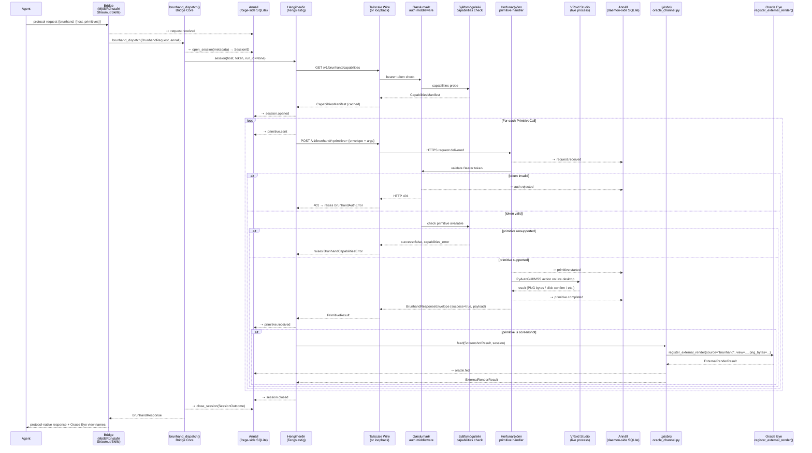

---

## IV. Sequence Diagram — Mode C (Both Arms, Shared run_id)

*How the shared `run_id` is minted at the Bridge layer and threaded into both dispatch arms, enabling cross-Annáll reconstruction of the combined agent operation.*

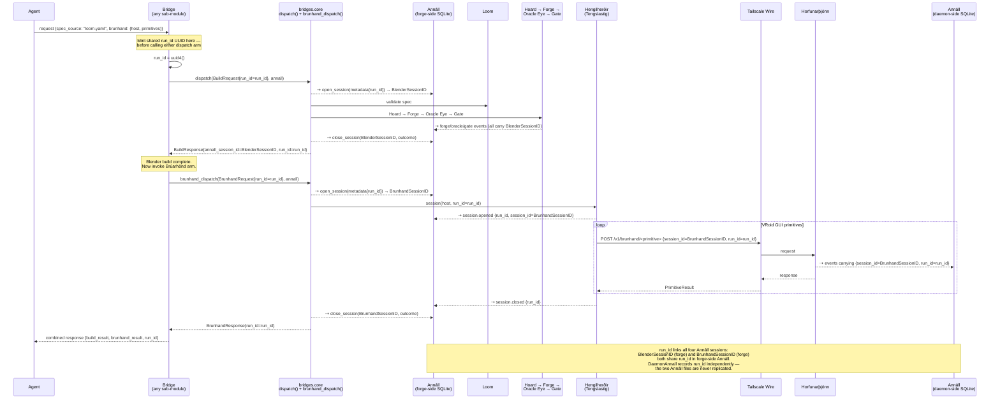

---

## V. The Network Path — Across Tailscale

*Two deployment topologies. The trust boundary is explicit.*

```mermaid
graph LR
    subgraph ForgeHost ["Volmarr's Development Machine"]
        FORGE_PROC["seidr_smidja process\n[FORGE]\nHengilherðir client\nPort: outbound only"]
        TS_NIC_FORGE["Tailscale virtual NIC\n(e.g. 100.x.y.z)"]
        FORGE_PROC -->|"HTTPS to\nvroid-host.tailnet.ts.net:8848"| TS_NIC_FORGE
    end

    subgraph Tailscale ["Tailscale Overlay Network"]
        TUNNEL["WireGuard-encrypted\nTailscale tunnel\nACL: forge → vroid-host port 8848"]
    end

    subgraph VRoidHost ["VRoid Host Machine"]
        TS_NIC_VROID["Tailscale virtual NIC\n(e.g. 100.a.b.c)\nMagicDNS: vroid-host.tailnet.ts.net"]
        DAEMON_PROC["[DAEMON]\nHorfunarþjónn process\nFastAPI on 127.0.0.1:8848\n(binds to Tailscale addr when configured)"]
        VROID_APP["VRoid Studio\n(live GUI process)"]
        TS_NIC_VROID -->|"arrives at port 8848"| DAEMON_PROC
        DAEMON_PROC -->|"PyAutoGUI / MSS"| VROID_APP
    end

    TS_NIC_FORGE --> TUNNEL
    TUNNEL --> TS_NIC_VROID

    style TUNNEL fill:#0a1a0a,color:#88cc88
    style DAEMON_PROC fill:#1a2e1a,color:#e0e0ff
    style VROID_APP fill:#2e2e1a,color:#e0e0ff
```

**Same-machine topology (loopback — no Tailscale involved):**

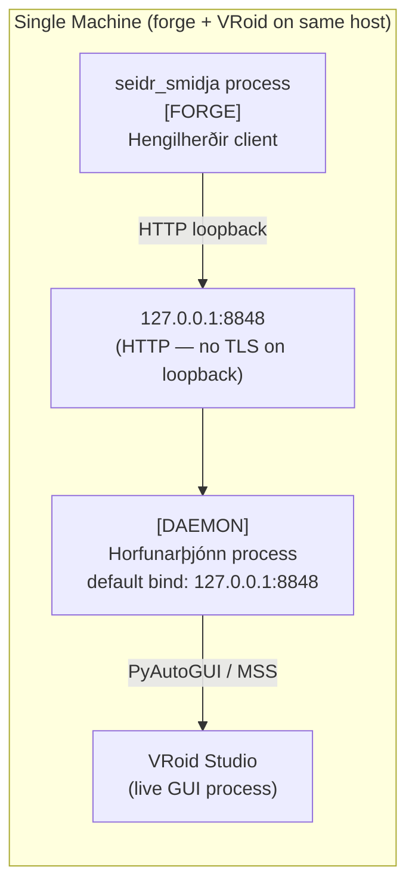

**Trust boundary summary:**

| Layer | Mechanism | Who enforces it |
|---|---|---|
| Outer wall — network access | Tailscale ACL (or loopback isolation) | Tailscale / OS |
| Inner wall — application authentication | Bearer token (`Gæslumaðr`) | Horfunarþjónn |
| Transport confidentiality | Tailscale WireGuard encryption (remote) / loopback (local) | Tailscale / OS |

The daemon does not verify Tailscale identity — it trusts the network-level ACL as the outer wall and relies solely on the bearer token as its own application-level proof of authorization. Both walls must stand independently.

---

## VI. Authentication Wiring

*From token birth to per-request validation. The token never appears in any log, trace, or response.*

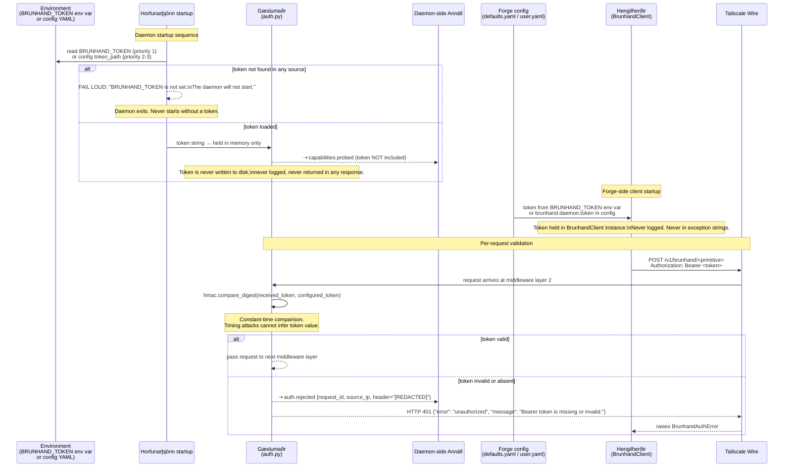

**Token rotation (v0.1 manual process):**
1. Update `BRUNHAND_TOKEN` env var on the VRoid host.
2. Update token in forge-side config.
3. Restart the daemon (`python -m seidr_smidja.brunhand.daemon`).
4. Old token is invalid immediately after restart. No grace period.

---

## VII. The Vision Loop — The Philosophical Heart

*The Brúarhönd analogue of the forge's vision feedback loop. Same shape, different physical substrate — a live desktop screen instead of a Blender render.*

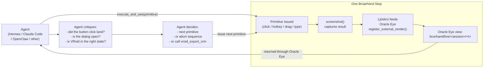

**`execute_and_see()` is the primary mechanism for this loop.** It is a first-class operation on `Tengslastig` that issues a primitive and immediately captures a screenshot in a single atomic client call:

```
sess.execute_and_see(sess.click, x=412, y=288)
  → ClickResult        (did the click succeed at the OS level?)
  → ScreenshotResult   (what does the screen show after the click?)
  → ExternalRenderResult (view registered in Oracle Eye, available to agent)
```

**The Oracle Eye is never closed here.** Every action that moves state can be followed immediately by `screenshot()`. The agent always has the option to see what its hand has done before issuing the next command. This mirrors the forge's core principle (Sacred Principle 2) extended across the wire.

---

## VIII. Failure Flows

*For each failure, what the agent receives, what each Annáll records, and what the recovery state is.*

---

### F1 — Tailscale Partition

**Condition:** Forge cannot reach the VRoid host's tailnet IP. The Tailscale overlay is down or the host is unreachable.

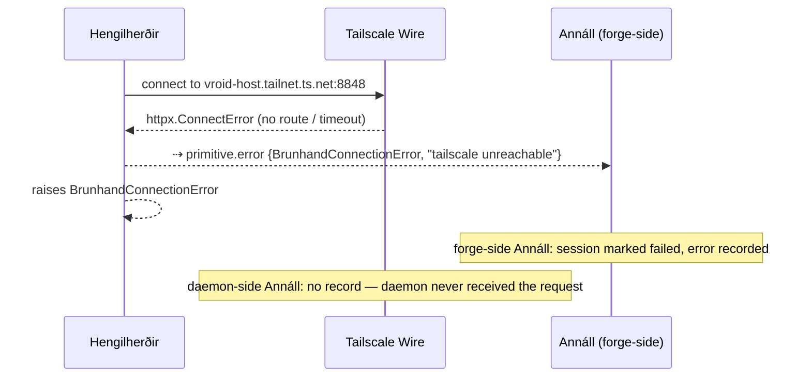

**Agent receives:** `BrunhandConnectionError` from `brunhand_dispatch()`. `BrunhandResponse(success=False, errors=[BrunhandError(type="connection", ...)])`.

**Recovery state:** Daemon is unaffected — it was never reached. VRoid Studio is unaffected. The agent may retry after Tailscale connectivity is restored.

**Annáll asymmetry:** Forge-side records the failure. Daemon-side has no record of this attempt.

---

### F2 — Daemon Unreachable (Tailscale up, Daemon Process Not Running)

**Condition:** Tailscale overlay is healthy; port 8848 is not accepting connections.

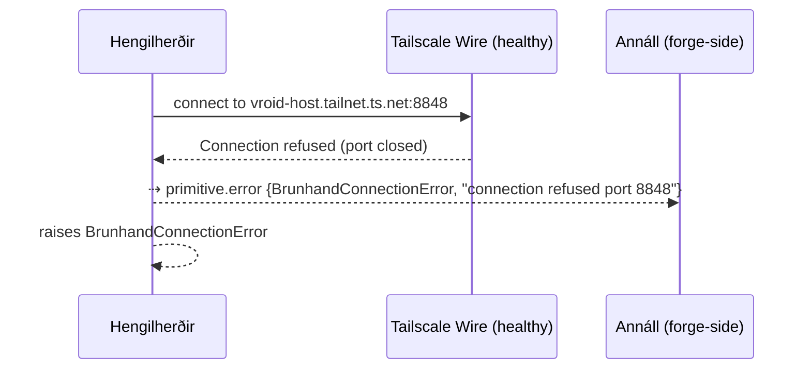

**Agent receives:** `BrunhandConnectionError`. Distinct from F1 only in the underlying httpx error detail.

**Recovery path:** Operator starts the daemon on the VRoid host: `python -m seidr_smidja.brunhand.daemon`. Then the agent retries.

**Annáll asymmetry:** Same as F1 — forge records the failure; daemon has nothing to record because it is not running.

---

### F3 — Bearer Token Invalid

**Condition:** Daemon is running, connection succeeds, but the token presented by the client does not match the daemon's configured token.

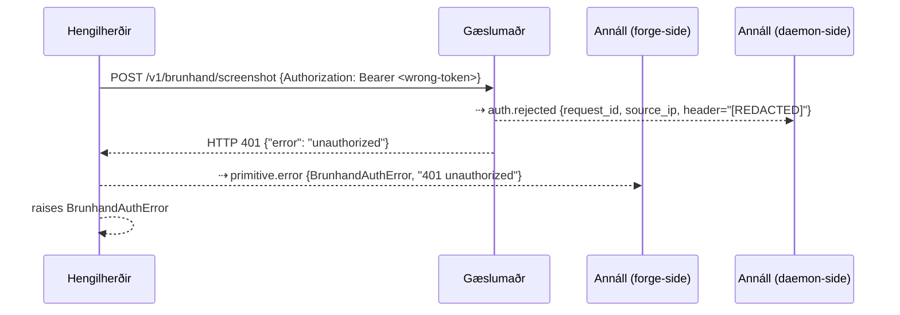

**Agent receives:** `BrunhandAuthError`. `BrunhandResponse(success=False, errors=[{type: "auth", ...}])`.

**Recovery path:** Token rotation (see Section VI). Note that retrying with the same wrong token will not succeed — `BrunhandClient` does NOT retry on 401 responses (per the retry policy in ARCHITECTURE.md §IV).

**Annáll asymmetry:** Both Annáll files record this failure. Daemon-side records the rejection event (source IP, `[REDACTED]` token). Forge-side records the `BrunhandAuthError`. The two records share `request_id` for correlation.

---

### F4 — Primitive Not Supported on This OS

**Condition:** Agent requests a primitive that `Sjálfsmöguleiki` reports as unavailable on the daemon's platform — e.g., `find_window_by_accessibility` on a Linux host where `pyatspi` is not installed.

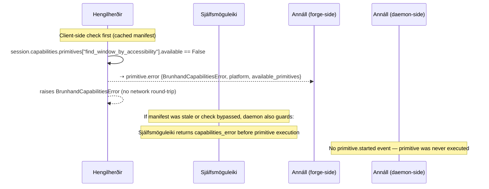

**Agent receives:** `BrunhandCapabilitiesError` (raised locally by Tengslastig from cached manifest, no network round-trip). Carries `primitive_name`, `platform`, `available_primitives` list.

**Recovery path:** Agent calls `sess.refresh_capabilities()` to get a current manifest, then chooses an available primitive. Or the operator installs the missing library and restarts the daemon.

---

### F5 — VRoid Studio Not Running

**Condition:** Agent requests a high-level VRoid primitive (`vroid_export_vrm`, `vroid_save_project`, `vroid_open_project`). Horfunarþjónn attempts the action but `psutil.process_iter()` finds no VRoid Studio process, or the VRoid window cannot be located.

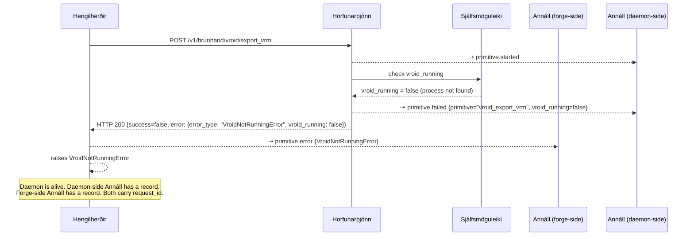

**Agent receives:** `VroidNotRunningError` (subclass of `BrunhandPrimitiveError`). Carries `vroid_running=False`.

**Soft-failure recovery path the agent can take:**
1. Agent receives `VroidNotRunningError`.
2. Agent may issue a `wait_for_window(title_pattern="VRoid Studio", timeout_seconds=60)` — waiting for the operator to launch VRoid Studio manually on the host.
3. Or agent may issue a `find_window(title_pattern="VRoid")` to confirm state before retrying.
4. Once VRoid Studio is detected, the agent retries `vroid_export_vrm`.

*This is the designed soft-failure recovery pattern. The daemon does not crash; the session remains open; the agent retains full control of the recovery sequence.*

---

### F6 — Primitive Timed Out

**Condition:** `wait_for_window` (or any long-duration primitive) exceeds its configured `timeout_seconds` without completing.

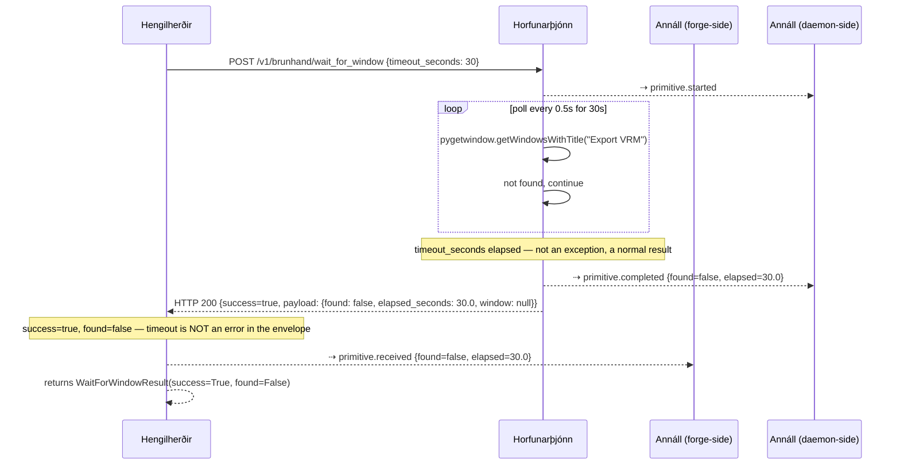

**Agent receives:** `WaitForWindowResult(success=True, found=False)`. This is a structured non-error result — the primitive executed correctly, it simply did not find the window within the allotted time. The agent decides what to do next: abort the sequence, wait longer with a new call, or inspect the current screen state with `screenshot()`.

**Note on httpx-level timeout vs. wait_for_window timeout:** The `wait_for_window` timeout parameter is the daemon-side waiting period, managed within the primitive handler. The httpx client-side `timeout_seconds` (default 30.0) must be set larger than `wait_for_window.timeout_seconds` to avoid the HTTP connection timing out before the primitive finishes. The Forge Worker must document and enforce this relationship.

---

### F7 — Daemon Crash Mid-Primitive

**Condition:** The daemon process dies while a primitive is in flight — either a Python-level exception that escapes all try/except (e.g., in FastAPI/uvicorn internals), an OS signal (SIGKILL), or a system crash on the VRoid host.

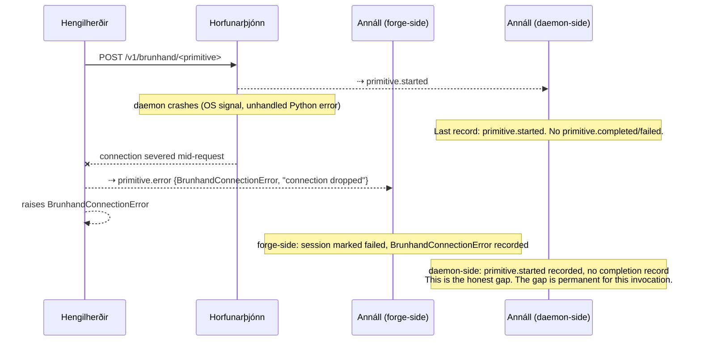

**Agent receives:** `BrunhandConnectionError`. `BrunhandResponse(success=False)`.

**The honest asymmetry:** The forge-side Annáll records `BrunhandConnectionError` as the outcome. The daemon-side Annáll has only `primitive.started` — because the process died before it could write `primitive.completed` or `primitive.failed`. **There is no way to know from either Annáll record alone whether the primitive completed its physical action on the desktop before the crash.** An agent reconstructing the session must treat the gap as an unknown — the click may or may not have landed, the screenshot may or may not have been captured. The next agent action after crash recovery should be `screenshot()` to establish ground truth.

**Recovery path:** The operator restarts the daemon. The agent issues `health()` to confirm the daemon is back, then continues from a known good state (typically a `screenshot()` to re-establish where VRoid Studio is).

---

## IX. The Two-Annáll Topology — Explicit Asymmetry

*This section exists to prevent a specific category of confusion: an operator or agent querying the forge-side Annáll and expecting to find daemon-side forensic detail, or vice versa.*

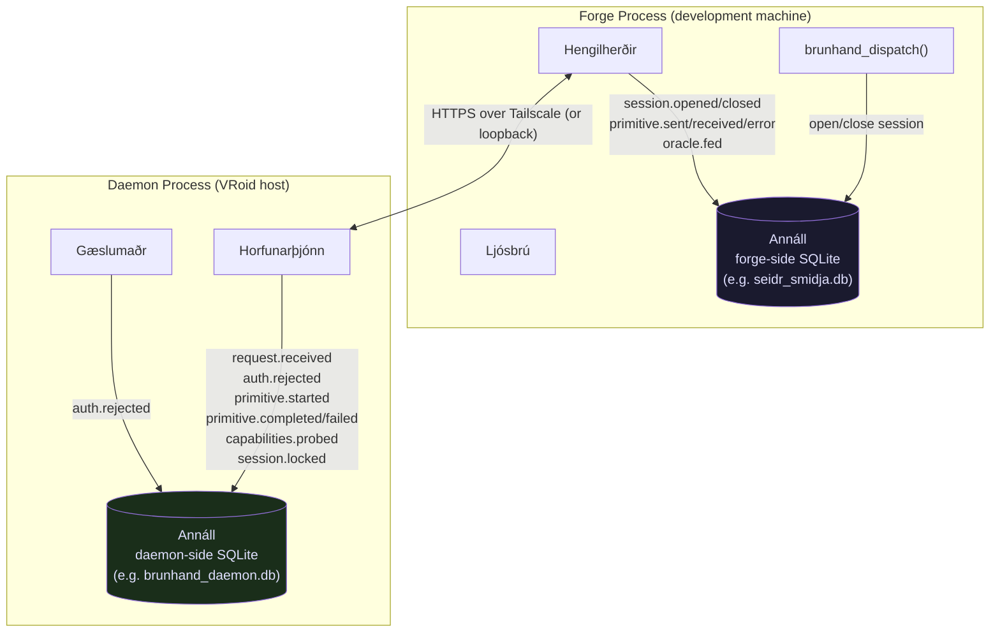

**What the forge-side Annáll can reconstruct:**

| Query | Answer available from forge-side? |
|---|---|
| Was a brunhand_dispatch session opened? | Yes |
| Which primitives were sent and when? | Yes |
| Did the client receive a successful response? | Yes |
| Were screenshots fed to Oracle Eye? | Yes |
| What run_id links this to a Blender build? | Yes |
| What exception did the client raise? | Yes |
| Was the bearer token valid on the daemon? | No — only "we received a 401" |
| What OS error occurred on the daemon? | Partial — error type returned in response; daemon-side stack trace is daemon-local |
| Was the primitive actually executed on the desktop? | Partial — success=true/false in response; daemon execution detail is daemon-local |
| What VRoid Studio state did the daemon observe? | Partial — vroid_running boolean in error responses |
| Screenshot metadata (monitor geometry, captured_at)? | Yes — returned in ScreenshotResult |

**What the daemon-side Annáll can reconstruct:**

| Query | Answer available from daemon-side? |
|---|---|
| Which requests arrived at the daemon? | Yes (all, including rejected ones) |
| Were any unauthorized requests attempted? | Yes |
| Which primitives started, completed, or failed? | Yes |
| OS-level error detail for failed primitives? | Yes |
| VRoid Studio running state per primitive? | Yes |
| Platform capabilities at startup? | Yes |
| What run_id links this to a Blender build? | Yes — if included in request envelope |
| What did the forge-side session decide to do? | No — forge logic is not visible to daemon |
| Which bridge (Mjöll/Rúnstafr etc.) sent the request? | Partial — agent_id is in envelope; bridge type is not |

**The critical asymmetry for F7 (daemon crash):**

When the daemon crashes mid-primitive, the daemon-side Annáll has `primitive.started` and nothing after it. The forge-side Annáll has `primitive.error {BrunhandConnectionError}`. **Neither file alone can determine whether the physical action completed.** Both files must be examined together — and even then, the answer may be "unknown." The honest recovery is to re-establish ground truth via `screenshot()` after the daemon is restarted.

**v0.1 reality — no replication:**

The two Annáll files are independent SQLite databases on separate machines. There is no streaming replication, no shared event bus, no synchronization mechanism between them in v0.1. Cross-machine Annáll queries require direct file access to the VRoid host (e.g., copying `brunhand_daemon.db` to the forge machine for local analysis, or SSHing into the VRoid host). This is a known limitation of the v0.1 architecture. v0.2 may address this with streaming replication or a shared event bus — but that is a future feature, not a current capability.

---

## X. Concurrency Model

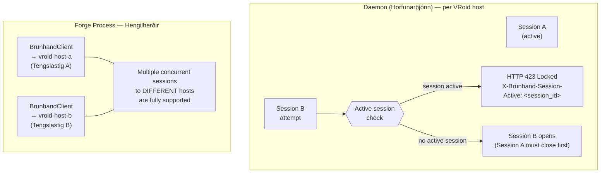

**One VRoid Studio instance, one desktop, one mouse cursor.** The daemon enforces single-session semantics because concurrent GUI automation on a single desktop is physically incoherent — two agents cannot both be moving the mouse at the same time. In v0.1, a second session attempt receives `HTTP 423 Locked` with the ID of the active session. The blocking session must close before a new one can open.

**Fan-out to multiple hosts.** The forge-side `Hengilherðir` can hold `BrunhandClient` instances targeting multiple distinct VRoid hosts simultaneously. Each host has its own daemon; there is no shared state between daemons. An agent managing multiple VRoid installations simply opens multiple `Tengslastig` sessions — one per host — and issues primitives to each independently.

**Thread safety note.** `Tengslastig` is not thread-safe by design. A single session must not be shared across Python threads without external locking. The typical usage pattern (one session per agent operation, in a single thread) requires no locking.

---

## XI. Cross-References

| Document | Relationship |
|---|---|
| [VISION.md](./VISION.md) | Feature soul, Primary Rite narrative, True Names, and the Unbreakable Vows |
| [ARCHITECTURE.md](./ARCHITECTURE.md) | Structural decomposition: daemon layers, client class architecture, dispatch seam, session pattern, failure model, concurrency model |
| [PHILOSOPHY_ADDENDUM.md](./PHILOSOPHY_ADDENDUM.md) | Sacred principles VI–IX: authentication, vision unity, honest limits, wire ownership |
| [../../DOMAIN_MAP.md](../../DOMAIN_MAP.md) | System-level domain graph; Brúarhönd addendum at bottom |
| [../../DATA_FLOW.md](../../DATA_FLOW.md) | Project-level data flow for the Blender pipeline (Mode B — Forge Only) |
| [../../../src/seidr_smidja/brunhand/INTERFACE.md](../../../src/seidr_smidja/brunhand/INTERFACE.md) | Top-level domain contract; `brunhand.session()` and `brunhand_dispatch()` |
| [../../../src/seidr_smidja/brunhand/daemon/INTERFACE.md](../../../src/seidr_smidja/brunhand/daemon/INTERFACE.md) | Full daemon HTTP API: all endpoints, request/response schemas, error codes, Annáll events |
| [../../../src/seidr_smidja/brunhand/client/INTERFACE.md](../../../src/seidr_smidja/brunhand/client/INTERFACE.md) | Client Python API: `BrunhandClient`, `Tengslastig`, `Ljósbrú`, exception hierarchy |

---

*Drawn at the bridge-fire, 2026-05-06.*
*Védis Eikleið, Cartographer — for Volmarr Wyrd.*
